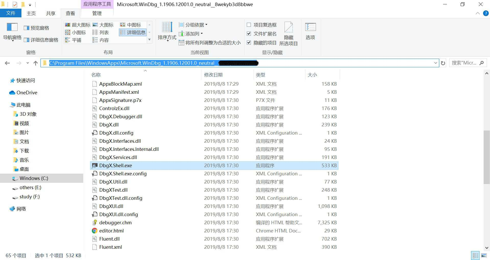
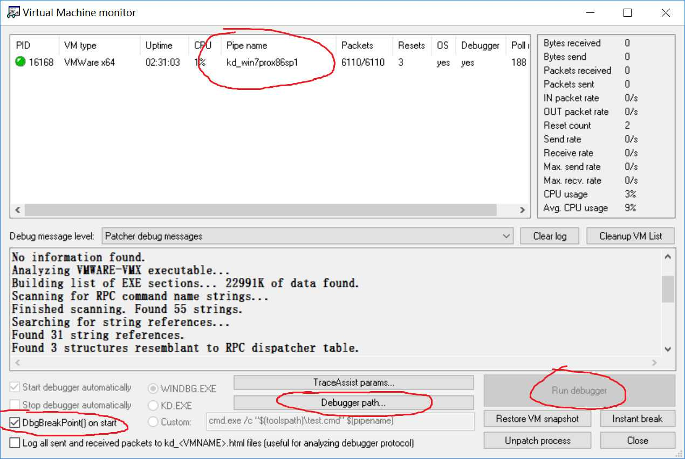
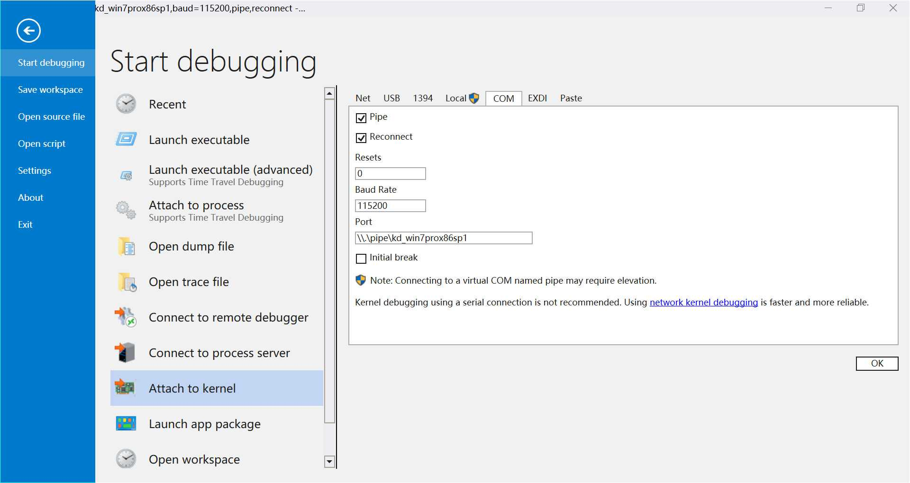
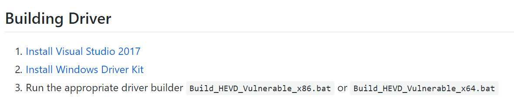
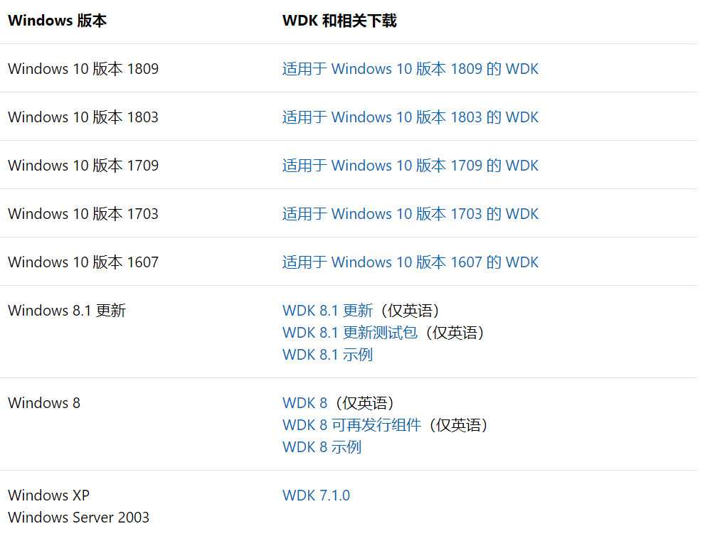
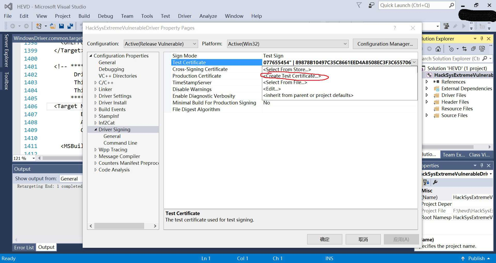
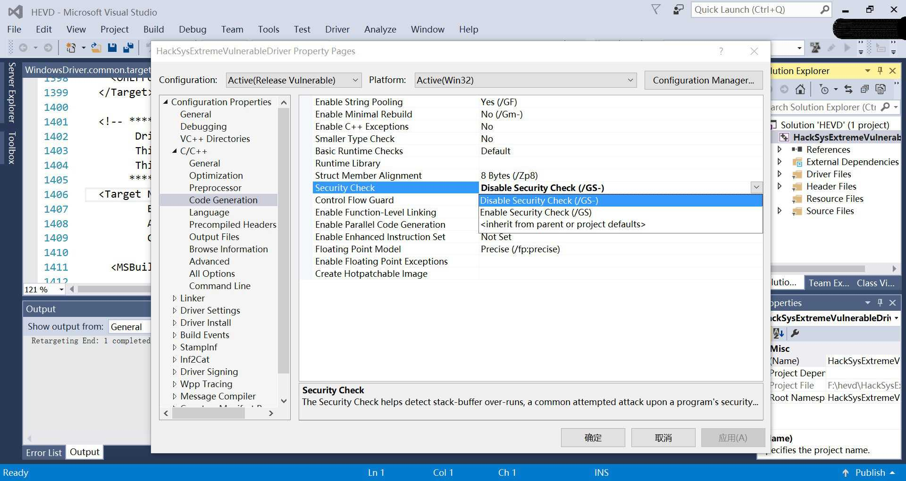
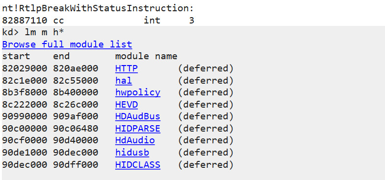
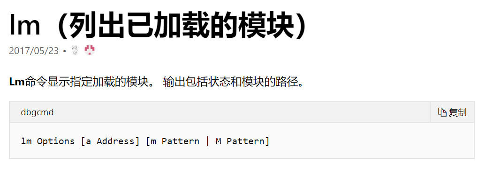

## 0x00 前言
在开始之前肯定要先搭建起 HEVD 的环境。环境搭建一直都是一件费时的工作，而且讲真这个过程要是一直出现问题真的会让人有点小难受。不过每个人的环境肯定都或多或少有所区别，所以这篇文章更多的是起一个参考作用，具体怎么操作还是要落实自己的环境上。

那么首先就是我们应该要准备什么样的环境以及为什么
> - win7 pro x86 sp1: 这是我个人使用的环境，当然使用x64也行
> - windbg + virtualkd: virtualkd 的作用一是加速宿主机与虚拟机的通信速度，二是帮我们快速构建起 debug 环境。
> - hevd + osrloader: 平时我们安装驱动程序都是使用一个安装程序来进行安装的，但是我们编译出来的只有一个.sys文件，要想让这个.sys文件在虚拟机上起作用的话，就要用到 osrloader 来加载该驱动程序。

当然就算不解释它们的作用大家也能在这个过程中明白它们都是做什么的，只是可能要耗费一些时间。让大家一开始就明白各个软件的作用也能在使大家在搭建的过程中更为清晰地知道自己在做什么，为什么要这样做。

## 0x01 环境搭建
网上关于 HEVD 的搭建过程以及各个软件的下载、安装与使用过程都有不少的教程了，因此本节更多的是点出一些关键点，剩下的我相信不用写大家也懂。

### win7pro x86 sp1虚拟机的安装
emmm我觉得这个我应该不用多说了，就是建议大家下pro版的或者是enterprise版的，因为比较好破解 (支持正版啊不过一个虚拟机就没必要用正版的了吧emmm

### windbg
如果大家是 win10 电脑的话直接在应用商店里搜索 windbg preview 就可以了，个人觉得这个版本的 windbg 界面就很美观。当然网上也有很多老版本的 windbg，而且不知道是 WSDK 还是 WDK 中也自带了 windbg，不过 windbg preview 应该是最美观好用的一个版本吧。

**下载完 windbg 后记得设置符号包(symbol)，它能让你在调试过程中舒服很多**

不过如果使用 windbg preview 在 virtualkd 中可能会遇到一点小问题，后文会给出解决办法。

### virtualkd
前面也说了，virtualkd的作用一是加速宿主机与虚拟机的通信速度，二是帮我们快速构建起 debug 环境。

看到这两个作用就可以知道即使没有 virtualkd 也没关系。只要在虚拟机的启动项中添加 debugport 参数为串行端口，让串行端口使用和 windbg 一样的命名端口就可以建立其调试环境了。至于通信速度的话我也不知道没有优化的话是什么样的一个速度，因为一开始搭建的过程中看到这个能优化速度就直接使用这个方法了，有兴趣的朋友可以试一试。

接下来是 virtualkd 的安装和使用过程，我觉得这篇文章 ([virtualkd安装教程](https://blog.csdn.net/lixiangminghate/article/details/78659646)) 已经写得很好了，我就没必要再复写一遍了。下文仅给出上面说到的使用 windbg preview 中可能存在的问题。

windbg preview的下载路径是这个

可是这个文件无法被 virtualkd 识别，并且你还打不开它（所属用户是SYSTEM）

#### virtualkd Debugger path 设置问题
在虚拟机上安装完 vitualkd 后，我们要建立起 windbg 和虚拟机的通信，就要在宿主机上打开 vmmon64.exe（32位机器打开32位版本）

假若我们是在应用商店安装的 windbg preview，那么是不是 Debugger path 下根本找不到这个调试器 : )

看到上面的红圈，vm monitor 为虚拟机创建了一个 debug 的命名端口，其实就算是其它版本的 windbg，可以被 Debugger path 识别并且通过 Run debugger 打开，其原理也是一样的，都是通过这个 debug 的命名端口来连接。

因此，我们只需在 windbg preview 中这样配置就好了

这里顺便提一下运作过程
> 1. 打开宿主机上的 vm monitor，看到上图左下角的红圈中勾中的选项，它在虚拟机的开机过程中下了一个断点，可以让我们调试包括开机过程，这个断点的位置大概是在阶段0初始化开始的位置（我猜的）
> 2. 打开虚拟机
> 3. 打开 windbg 并连接

### hevd
> 这里先总括一下具体该做的事，但请耐心看完该小节后再动手

> 1. 从 github 上下载 HEVD
> 2. 下载某个版本的 Visual Studio
> 3. 下载相应版本的 WSDK 和 WDK
> 4. 为驱动程序添加证书
> 5. 关闭 GS 选项卡
> 6. 编译

编译一个驱动程序其实应该很简单，毕竟写项目的人都把项目写成这样了，但由于网上的教程大部分都没写得太详细，所以这个过程可能会出问题然后耗费很多时间

首先看到 github 上的文档
上面说直接运行.bat文件就可以了，亲测了一下发现编译链接过程用的 Cmake，其中似乎还需要 Ninja，不太清楚毕竟我没用过 Cmake 编译东西，这里我选择用 VS 进行编译。

个人的版本是 Visual Studio 2015，然后看到第二步， 编译驱动程序当然需要 WDK 了，该链接指向官网。

这里先说明一个比较重要的概念，先看两张图

**WDK 的版本跟随的应该是 Visual Studio 的版本而不是 Windows 的版本**

比如说我的电脑装的是 Visual Studio 2015，那么看到第一张图我们可以装 Windows 10 1703 或 Windows 10 1607 版本的WDK，然后去第二张图上的链接下载WDK。
**这里亲测对 Visual Studio 2015 来说，1703 的那个版本是可用的。**
下载下来的 WDK 版本号为10.0.15063.X

装好了 WDK 后用 VS 打开 Driver 文件夹下的.sln文件，选择好对应的配置后（比如 release vulnerable x86） 就可以开始 build 了，但是这时候编译其实是会报错的，原因是没有安装 WSDK，这里给出 [WSDK的下载链接](https://developer.microsoft.com/en-us/windows/downloads/sdk-archive)。

**注意 WSDK 的版本一定要和 WDK 的版本相对应，比如在我的环境下我安装的 SDK 版本为10.0.15063.X**

（如果没有的话就略过去吧）接下再次编译，又会看到说找不到叫 HEVD.cer 的 TestCertificate 这样一个报错信息。其原因是因为现在 Windows 的驱动程序是需要签名的，我们可以使用 Windows 的测试证书来进行签名，一个是修改引导时的配置信息来使用测试证书为驱动程序进行签名，但我感觉这样太暴力了，另一个方法是编译时生成测试证书并使用它来进行签名，具体操作方法是在 VS 中的 project -> properties -> driver signing 中添加测试证书，如图所示点红圈那里

至此就可以看到在新生成的文件夹下生成了.sys文件了，这就是我们要的驱动程序。当然若不想在对每个漏洞进行利用的同时又绕过一次 GS 保护，我们在编译之前应该先关闭 GS 选项

### OSRLoader
生成了.sys驱动程序以后最后把它放到虚拟机上启动服务就行了，这就是OSRLoader的作用。

到官网上下载 OSRLoader 安装完了之后打开到 Projects\OsrLoader\kit 目录你可以看到好几个文件夹，对应在不同版本的操作系统下的 OSRLoader 版本。我的目标系统是 win7， 所以应该打开 WNET 文件夹下的OSRLoader。

> 这里顺便提一下其它几个文件夹的目标操作系统

> - w2k: windows 2000
> - WLH: windows vista
> - WNET: 讲真这个名字我真不知道啥意思，有知道的师傅还请教一教我。。。
> - WXP: windows XP

**还有一点就是选择完 path 之后，应该先点击注册服务再点击开始服务。**

## 0x02 测试环境是否搭建成功
> 1. 打开 vmmon
> 2. 打开虚拟机
> 3. 打开 windbg 并连接

若 windbg 连接成功则说明 virtualkd 起作用了。

接下来用 OSRLoader 加载驱动程序，然后在 windbg 中输入命令 lm m h*如果能在输出中看到 HEVD 模块，则说明环境搭建成功了。

这里解释一下 lm m h* 命令

而 h* 就是一个通配符

## 0x03 结束语
该环境用于之后的 HEVD 漏洞利用的学习

---

2019.8.25

