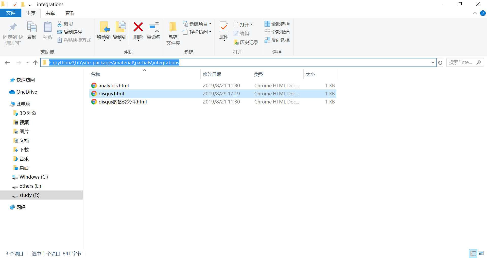
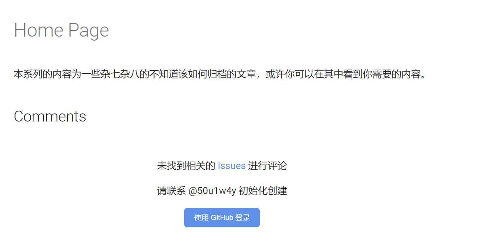

<small>转载请注明出处哦 :  )</small>

## 0x00 前言
搜了下网上好像没有针对于 mkdocs-material 的 gitalk 使用方法。于是自己一顿瞎几把操作还好最后还是搭建成功了，这篇文章写给同样想要使用 mkdocs-material 来搭建 gitalk 的读者，以使你们能迅速地搭建起 gitalk。

## 0x01 使用 mkdocs-material 搭建 gitalk
首先我们需要这么一段代码

```html
<h2 id="__comments">{{ lang.t("meta.comments") }}</h2>
<form id="gitalk-form" onsubmit="return false;">
    <div id="gitalk-container"></div>
</form>
<link rel="stylesheet" href="https://unpkg.com/gitalk/dist/gitalk.css">
<script src="https://unpkg.com/gitalk/dist/gitalk.min.js"></script>
<script src="https://cdnjs.loli.net/ajax/libs/blueimp-md5/2.10.0/js/md5.min.js"></script>
<script>
    const gitalk = new Gitalk({
        clientID: '', // add yourself's
        clientSecret: '', // add yourself's
        repo: 'comment',
        owner: '50u1w4y',
        admin: ['50u1w4y'],
        id: md5(location.pathname),      // Ensure uniqueness and length less than 50
        distractionFreeMode: false  // Facebook-like distraction free mode
    })
    gitalk.render('gitalk-container')
</script>
```

在你的 github 下新建一个专门用来放评论的仓库 comment，当然你可以使用任何仓库。

接下来申请 clientID 和 clientSecret。[点击这个链接](https://github.com/settings/applications/new)就可以申请了。

> Application name 可以随便取个名字

> Homepage URL 就是你博客的主页地址

> Authorization callback URL 就是别人登录完之后的回调地址，一般来说保持和 Homepage URL 一样就可以了

申请完之后把得到的 clientID 和 clientSecret 填到上面的代码中。

接下来是 mkdocs-material 的搭建方法，和其它框架会有所不一样。

首先你应该在本地安装好了 mkdocs-material。没安装的用 pip 安装一下就好了。

然后看到这个路径

用刚刚的代码覆盖掉 disqus.html，效果类似于(假设代码保存在文件 gitalk.html 中)

```cmd
cp .\static\gitalk.html F:\python2\Lib\site-packages\material\partials\integrations\disqus.html
```

这时候到你的博客的根路径下运行 mkdocs build 就好了，你可以看到生成的 site 文件夹下的页面文件中包含了上面的代码

此时访问一下自己的博客就可以看到 gitalk 功能了



## 0x03 结束语
其实在学习的过程中会很经常遇到一些网上搜索不到的内容，像这种有迹可循的还好说，那种无迹可寻又没人能问的情况才是真的难顶。

---
<p align='right'>2019.8.29</p>